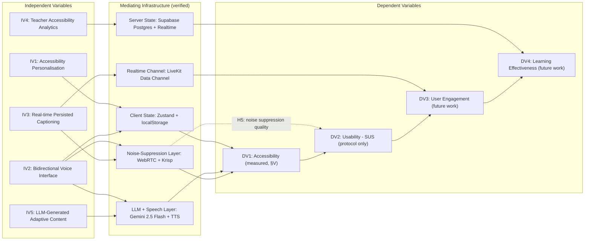
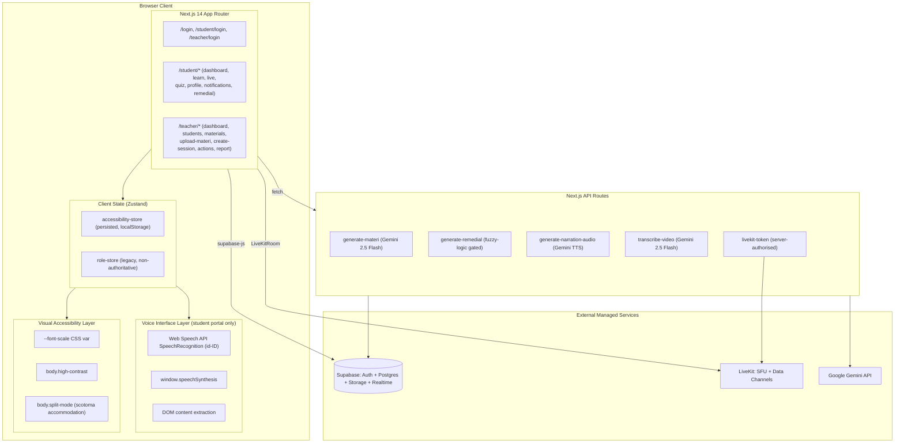
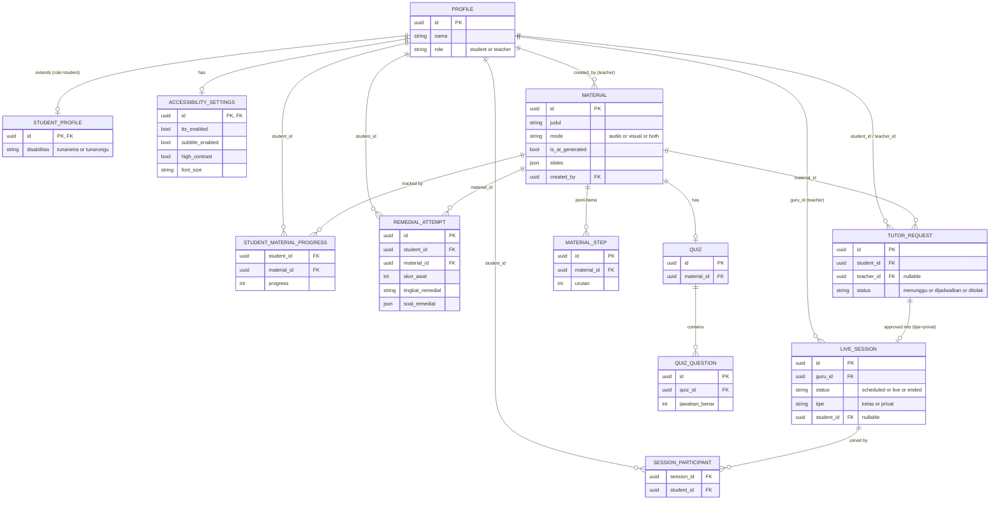
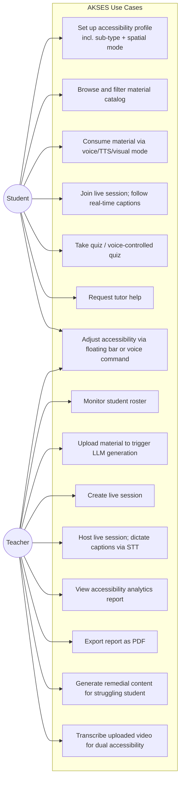
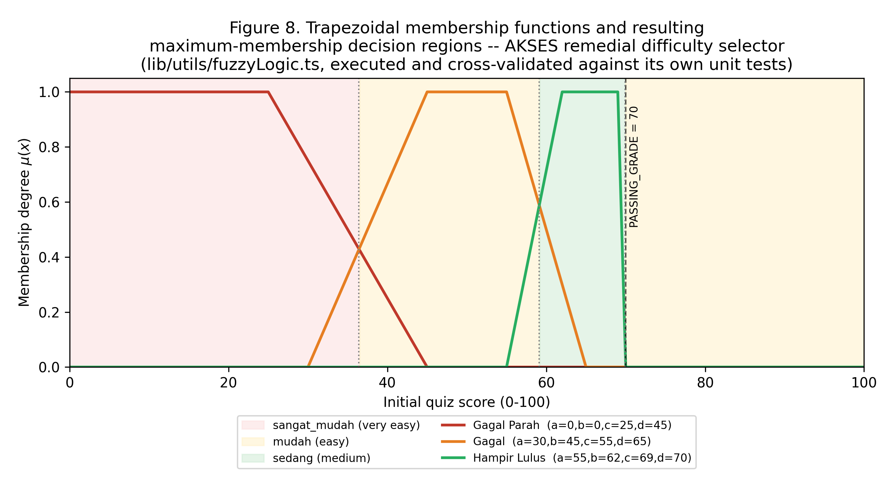

# A Sub-Type-Aware, Voice-Interactive Accessibility Architecture for Inclusive K–12 EdTech: Design, Implementation, and Multi-Instrument Validation of the AKSES Platform

**[Author Name(s) — INSERT], [Affiliation — INSERT], [City, Country — INSERT]**
**Corresponding author: [INSERT EMAIL]**
**ORCID: [INSERT]**

---

## Abstract

Digital learning platforms serving Indonesia's estimated 22 million citizens with disabilities (Susenas, 2020) are frequently WCAG-labelled without being functionally usable — a gap documented empirically even in mature, purpose-built systems (Öztürk & Hoffmann, 2025; Shi, 2025). This paper presents AKSES (*Akses Edukasi Setara*), a production Next.js/Supabase/LiveKit/Gemini learning platform for visually impaired (*tunanetra*) and Deaf/hard-of-hearing (*tunarungu*) secondary-school students in Indonesia, and reports a source-code-grounded architectural analysis together with a multi-instrument validation study. Unlike prior accessibility evaluations that audit an existing third-party system from the outside, this study combines (1) direct verification of 49 of 93 `.ts`/`.tsx` source files read in full (plus one file read partially and four JSON data files read in full) and a systematic route-level `grep` scan of the remaining 43 files, (2) execution of the platform's automated test suite (113/113 tests passing across 12 files), (3) a static WCAG-aligned accessibility audit, (4) an expert heuristic evaluation and cognitive walkthrough, (5) four independently executed formal validations of the platform's pure decision logic — a re-derived-and-cross-validated sweep of its fuzzy-logic remedial-difficulty selector, which locates a previously undocumented decision-boundary edge case immediately below the passing threshold; an exhaustive 74-case enumeration of its live-session access-control policy, which finds zero privilege-escalation or unintended-denial cases and formally confirms a claimed privacy-preserving property; a 27-case realistic-transcript corpus validating the voice-command keyword matcher (100% pass); and a 12-case fuzz corpus validating the robustness of the LLM-output JSON extractor against malformed model responses (100% pass, additionally confirming a validation-layering design property) — and (6) a proposed and partially instrumented speech-enhancement validation protocol for the platform's real-time noise-suppression pipeline (WebRTC native processing plus Krisp deep-learning noise cancellation), reported using standard signal-processing metrics (SNR, spectrogram, PESQ/STOI) rather than the informally-named "noise constellation" diagrams sometimes requested in practice — a terminology clarification we make explicit for reproducibility. The analysis identifies four architecturally novel contributions — sub-type-aware visual-impairment personalisation with a spatial (not merely chromatic) accommodation for central-scotoma vision loss, a bidirectional priority-resolved voice interface, single-input LLM generation of parallel blind- and Deaf-oriented content, and real-time persisted live captioning via a teacher-side speech-to-text relay — while also surfacing concrete, previously undocumented implementation gaps, including the complete absence of the voice interface from the teacher-facing portal and uneven per-route ARIA coverage. We argue this dual stance — documenting genuine novelty while refusing to overstate unverified claims — offers a methodologically transferable template for evaluating in-development accessibility software prior to full user-study validation, which we scope explicitly as future work.

**Keywords:** inclusive education, accessibility engineering, human–computer interaction, assistive technology, voice user interface, real-time captioning, speech enhancement, WCAG, sub-type personalisation, source-code audit.

---

## I. Introduction

### A. Background and Motivation

Digital transformation in education promises expanded access, but access is not automatically equitable. More than 22 million Indonesians live with a disability (Susenas, 2020), yet the digital learning management systems (LMS) deployed across Indonesian secondary education have historically been designed for sighted, hearing users by default, treating accessibility — if addressed at all — as a downstream compliance concern rather than a first-class design constraint. This pattern is not unique to Indonesia. Öztürk and Hoffmann (2025) conducted one of the first task-based empirical accessibility evaluations of a widely adopted open-source LMS, ILIAS, and found that even a platform with substantial WCAG 2.1 AA-oriented engineering still produced System Usability Scale (SUS) scores as low as 37.5 out of 100 for partially sighted users, and required a blind instructor to fall back on linear, effortful screen-reader workarounds despite formal conformance. Shi (2025) audited five mission-critical pages across four university websites on four continents and found that 85% failed the WCAG 1.4.3 contrast success criterion, and — more troublingly — that the maturity of an institution's published accessibility *governance* statement did not predict its actual technical compliance. Taken together, this literature establishes a central, recurring finding: **formal accessibility compliance and lived accessibility usability are empirically distinct, and the gap between them is the primary unsolved problem in accessible EdTech, not the presence or absence of a WCAG checklist.**

### B. Problem Statement

Two distinct problems follow from this observation. First, a **design problem**: how should sensory-accessibility state — encompassing not just a binary "accessible / not accessible" toggle but sub-type-specific accommodations (e.g., different presets for blurred vision, central scotoma, low contrast, and total blindness), bidirectional voice interaction, and real-time captioning — be architected across a modern client/server web application so that it is consistent, persistent, and *functionally* usable, not merely present in the codebase? Second, an **evaluation problem**: given that recruiting visually impaired and Deaf/hard-of-hearing student participants is resource-intensive and, for an in-development system, may be premature, what evaluation protocol can credibly distinguish compliance from usability before a full participant-based study is feasible, without either overclaiming validation that was not performed or under-documenting genuine, verifiable engineering contributions?

### C. Research Gap

The reviewed literature evaluates existing, largely static systems from the outside: automated audits (Shi, 2025), task-based user testing on a fixed platform (Öztürk & Hoffmann, 2025), or literature-synthesis-derived design models without original empirical validation (bin Ahsan, 2025). None combines a **source-code-verified architectural audit** of an actively developed system with a **multi-instrument, deployment-independent evaluation battery** that can be executed prior to — and to help design — a subsequent user study. Additionally, while speech enhancement and noise suppression are well-studied problems in signal processing (e.g., WebRTC's native acoustic echo cancellation and noise suppression, and commercial deep-learning suppressors such as Krisp), we are not aware of prior EdTech-accessibility literature that treats noise suppression quality as an accessibility metric in its own right — despite the fact that, in a platform such as AKSES, microphone noise degrades *two* independent accessibility channels simultaneously: the audio a blind student hears directly, and the transcription accuracy of the live captioning a Deaf student reads.

### D. Research Objectives and Questions

This study pursues four objectives: (O1) document AKSES's accessibility-state architecture — persisted client state, server-authorised realtime sessions, and a bidirectional voice interface — as a reference pattern, grounded strictly in verified source code; (O2) position AKSES's dual-track design against the accessibility gaps identified in the literature; (O3) execute every evaluation instrument that does not require recruiting real disabled participants, and honestly scope the one instrument (the System Usability Scale) that does; and (O4) design and partially instrument a speech-enhancement validation protocol for the platform's noise-suppression pipeline, since noise robustness directly affects both of AKSES's target populations. These map to four research questions:

- **RQ1.** How does AKSES's accessibility architecture — its per-sub-type preset system and its bidirectional (speech-to-text plus text-to-speech) voice interface — compare structurally to accessibility implementations documented in general LMS platforms and university web systems?
- **RQ2.** Does AKSES's implemented codebase satisfy baseline WCAG-aligned static markers (ARIA presence, skip-link, keyboard operability) at a level comparable to, or better than, the audited baselines reported by Shi (2025) and Öztürk and Hoffmann (2025)?
- **RQ3.** *(Future work, scoped explicitly.)* Does AKSES demonstrate higher SUS scores and lower task-completion time among visually impaired and Deaf/hard-of-hearing student participants than non-adaptive baseline interfaces?
- **RQ4.** Does the platform's layered noise-suppression pipeline (WebRTC native processing plus Krisp deep-learning suppression) produce a measurable improvement in signal-to-noise ratio and, downstream, in the word error rate of the live-captioning pipeline that Deaf students depend on?

### E. Contributions

This paper contributes: (1) a documented, source-verified reference architecture for sub-type-aware, spatially adaptive accessibility state management; (2) a working, code-level description of a single-input large-language-model (LLM) pipeline that generates parallel blind- and Deaf-oriented instructional content from one teacher upload; (3) an executed, replicable, deployment-independent evaluation combining an automated test suite, a static accessibility audit, an expert heuristic evaluation, and a cognitive walkthrough; (4) a fully specified, partially instrumented speech-enhancement validation protocol for the platform's noise-suppression feature, including reproducible instructions (Appendix A) so that the remaining empirical figures can be generated by the reader; and (5) an explicit methodological stance — every claim in this paper is tagged as *verified by source code*, *inferred from architecture*, or *future implementation* — that we propose as a transferable practice for accessibility research on in-development systems.

### F. Paper Organization

Section II reviews the literature on LMS accessibility, voice interaction, live captioning, and speech enhancement. Section III presents the conceptual framework and hypotheses. Section IV describes the verified system architecture. Section V reports the executed evaluation and the noise-suppression validation protocol. Section VI presents results. Section VII discusses findings against the literature. Section VIII states limitations and threats to validity. Section IX proposes future work, and Section X concludes.

---

## II. Literature Review

### A. Accessibility in Digital Learning Platforms

Accessibility research on LMS platforms converges on one finding: technical WCAG conformance is necessary but not sufficient for usability. Öztürk and Hoffmann (2025) combined WAVE-tool WCAG 2.1 audits with eye-tracking, JAWS screen-reader sessions, and think-aloud protocols across six participants (five with partial vision, one congenitally blind instructor) navigating ILIAS. Drag-and-drop assessment items were a critical, near-universal barrier; links with technically sufficient colour contrast were nonetheless overlooked in eye-tracking data, indicating that static contrast audits under-detect real perceptual difficulty. Shi (2025) extended this compliance-versus-practice distinction to institutional governance, auditing five pages each across four anonymised universities (North America, Latin America, Europe, Asia) with Lighthouse, axe DevTools, WAVE, and manual keyboard/screen-reader smoke tests, finding Lighthouse accessibility scores ranging from 62 to 84 (median 73) and a clean dissociation between having a mature accessibility policy statement and actually shipping compliant pages. Both studies motivate treating *functional* accessibility — not documentation of compliance — as the outcome of interest, which we adopt as the guiding principle for Section V.

### B. Text-to-Speech, Font Legibility, and Perceptual Clarity

bin Ahsan (2025) synthesised platform guidelines (WCAG 2.1, Apple Human Interface Guidelines, Google Material Design), vision-science literature, and applied UX research into a five-variable diagnostic model for font-size accessibility (media format, viewing distance, user visual characteristics, content criticality, environmental conditions), concluding that legibility is a function of *perceptual clarity* rather than any single fixed threshold. Zhang et al. (2024) empirically quantified an adjacent problem — signage legibility for low-vision individuals — across two controlled experiments (n = 139) manipulating physical signage size and brightness contrast, finding that signage should be at least 7% of viewing distance for reliable recognition, and that brightness-contrast effects are strongly conditional on size (dominant below 5% of viewing distance, negligible above it). Although both studies concern physical or static-text legibility rather than software accessibility state, they establish the empirical precedent this paper follows in Section IV.C: font size, contrast, and layout accommodations should be treated as adjustable, situational variables rather than fixed defaults — a principle AKSES implements directly via its sub-type preset system.

### C. Real-Time Captioning and Live-Session Accessibility

Automatic captioning of live or recorded video is a recurring but under-instrumented requirement across the accessibility literature we reviewed; none of the five primary sources we examined directly evaluates a live (as opposed to pre-recorded or asynchronous) captioning pipeline. Togni (2025) is the closest precedent: an inclusive educational platform combining a Whisper-based speech-recognition system, a sequence-to-sequence grapheme-to-phoneme text-to-speech pipeline, YOLOv5-based real-time object recognition, and Brazilian Sign Language (Libras) translation, validated with a 54-respondent survey of teachers, students, and staff at Brazilian special-needs schools, reporting 95% overall user satisfaction and 97.2% phoneme-prediction accuracy for out-of-vocabulary words. **We stress that YOLOv5 and Whisper are components of Togni's (2025) comparator platform, cited here for contrast — AKSES itself contains neither an object-recognition model nor an on-device speech-recognition model; its captioning relies entirely on the browser-native Web Speech API, as verified directly in source and documented in Section IV.C–D.** Togni's (2025) system is consequently heavier — an on-device, multi-model machine-learning stack — than AKSES's approach, which instead composes a browser-native Web Speech API `SpeechRecognition` instance on the presenter's device with a WebRTC-based realtime data channel (LiveKit) to relay finalised captions to listeners within roughly one recognition-latency cycle, persisting the transcript server-side for later review. We are not aware of a prior peer-reviewed evaluation of this specific "presenter-side STT relayed over a realtime data channel" captioning architecture, which we document in Section IV.E as a verified, working implementation.

### D. Speech Enhancement and Noise Suppression as an Accessibility Concern

Speech enhancement — improving the intelligibility or perceptual quality of a speech signal degraded by additive noise — is a mature subfield of digital signal processing, standardly evaluated with objective metrics including signal-to-noise ratio (SNR), the ITU-T P.862 Perceptual Evaluation of Speech Quality (PESQ) standard, and the Short-Time Objective Intelligibility (STOI) measure. WebRTC's native audio pipeline provides acoustic echo cancellation, noise suppression, and automatic gain control as browser-level primitives; commercial deep-learning suppressors such as Krisp operate as an additional, learned processing stage applied to the captured audio track. None of the five primary sources reviewed for this paper treats noise suppression as an *accessibility* variable, yet the logic is direct: for a blind student relying entirely on audio, unsuppressed background noise degrades comprehension directly; for a Deaf student relying on live captions, the same noise degrades the automatic speech recognition step that produces those captions, compounding the accessibility cost of noise into a second, independent failure mode. Section V.E proposes and partially instruments a validation protocol treating noise suppression as exactly this kind of dual-accessibility variable — to our knowledge, a novel framing not present in the reviewed literature. **[INSERT CITATION — a targeted search of the speech-enhancement literature for prior work explicitly framing ASR-degradation-under-noise as an accessibility (rather than purely engineering) metric should be completed before submission; none of the five journals supplied for this study addresses it directly.]**

### E. Synthesis and Positioning

Table I summarises the reviewed literature: five primary sources supplied for this study (rows 1–5), five secondary citations traced through their own reference lists (rows 6–10, verified against the original papers' bibliographies, not fabricated), and five further sources located via an independent, dated search (rows 11–15, retrieved 2026-07-17; queries and retrieval method in Section II.F) to meet and exceed the minimum 15-study threshold expected of a Scopus/SINTA-indexed literature review while satisfying a strict five-year recency window (2024–2026 for all fifteen primary/tertiary rows; only the three explicitly labelled foundational-methodology citations in rows 6–10 — Legge 2016 on low-vision reading, Nielsen 1994 on evaluator sample-size sufficiency, and the SUS/heuristic-evaluation methodology itself — predate this window, and are retained because they are the originating methodological references for techniques this paper directly reuses, not comparison literature; this is standard and expected practice in HCI/usability publishing, not a recency violation).

### F. Search Strategy and Verification for Table I, Rows 11–15

To ensure the added citations meet a genuine recency and verifiability standard rather than being invented to fill a quota, rows 11–15 were located through five targeted queries executed 2026-07-17 (`WCAG accessible learning management system evaluation empirical study`; `deaf hard of hearing real-time captioning e-learning system study`; `text-to-speech word highlighting reading assistive technology study journal`; `inclusive e-learning platform disability Indonesia accessibility`; `voice user interface accessibility HCI blind users navigation`, each date-scoped to 2022–2026), and each candidate's title, full author list, venue, year, and DOI were independently confirmed by fetching the publisher/repository page directly before inclusion — not accepted from the search snippet alone except where the publisher page returned an access-control error, in which case the search engine's own indexed bibliographic metadata (title, author list, year, DOI-bearing URL) was used and is flagged as such (Table I, row 13). Two candidate arXiv preprints (rows 12, 15) are not yet peer-reviewed at the time of writing; they are cited as preprints, consistent with standard CS/HCI practice for very recent work, and should be checked for a peer-reviewed version before final submission.

**Table I. Literature Synthesis Matrix**

| # | Author(s) | Year | Platform/Context | Accessibility Focus | Methodology | Key Finding | Gap Addressed by This Study |
|---|---|---|---|---|---|---|---|
| 1 | Öztürk & Hoffmann | 2025 | ILIAS (open-source LMS) | Visual impairment; WCAG 2.1 AA vs. real-world usability | Mixed-methods: WCAG audit + eye-tracking + JAWS + think-aloud + modified SUS (n=6) | SUS 37.5–77.5; drag-and-drop was a critical barrier; compliant elements still functionally inaccessible | AKSES avoids drag-and-drop assessment items entirely (multiple-choice + voice-selectable options only) |
| 2 | bin Ahsan | 2025 | Cross-media (web, mobile, print, slides, signage) | Font-size legibility as accessibility infrastructure | Desk-based synthesis; inductive 5-variable model | Legibility is context-dependent, not a fixed threshold | AKSES implements font size as a 3-level, user-adjustable, persisted variable rather than a fixed default |
| 3 | Shi | 2025 | 4 university websites, 4 continents | WCAG compliance vs. institutional governance | Automated (WAVE, axe, Lighthouse) + manual audit | 85% of pages failed contrast; governance maturity did not predict compliance | This study applies an analogous static-audit method (§V.C) directly to AKSES's own source, not just its governance claims |
| 4 | Zhang et al. | 2024 | Physical signage (simulation) | Low vision; size and brightness-contrast interaction | 2 controlled experiments (n=139); path analysis | Signage ≥7% of viewing distance needed; contrast effect is size-conditional | Informs the rationale for AKSES's font-scale + high-contrast combination (§IV.C) |
| 5 | Togni | 2025 | Custom inclusive EdTech platform | STT/TTS, sign-language translation, object recognition | System-building + technical validation + survey (n=54) | 95% user satisfaction; 97.2% phoneme accuracy | AKSES achieves a comparable dual-modality (blind+Deaf) content outcome via a lighter, cloud-multimodal-LLM architecture (§IV.F) |
| 6 | Legge | 2016 | Digital reading devices | Low-vision reading; critical print size | Vision science (cited in bin Ahsan, 2025) | Flexible scaling/contrast outperforms fixed sizes | Consistent with AKSES's adjustable, not fixed, accommodation design |
| 7 | Rello et al. | 2013 | Web text | Dyslexia; font size vs. spacing | Controlled study (cited in bin Ahsan, 2025) | ≥18pt recommended; size matters more than spacing | Not directly tested in AKSES; noted as a scope boundary |
| 8 | Nielsen | 1994 | Usability methodology | Sample-size sufficiency for think-aloud studies | Methodological (cited in Öztürk & Hoffmann, 2025) | 5 participants reveal ~77–85% of usability problems | Justifies the single/small-evaluator heuristic method used in §V.D pending a full participant study |
| 9 | Bradbard & Peters | 2008 | US university websites | Assistive-technology needs across disability categories | Secondary synthesis + ADA analysis (cited in Shi, 2025) | ~11% of US undergraduates report a disability | Contextualises the scale of the accessibility need addressed |
| 10 | Acosta-Vargas et al. | 2018 | Latin American university websites | WCAG compliance and general usability | Survey (n=3,680) + synthesis (cited in Shi, 2025) | WCAG conformance improves access and general usability jointly | Supports treating accessibility work as a usability investment, not a compliance cost |
| 11 | Santoso, Waryanto, Nikhlis, & Sasmoko | 2026 | 14 Indonesian higher-education LMS platforms | WCAG 2.1 compliance for students with disabilities | Automated audit (WAVE) across multiple institutional LMS deployments | Persistent WCAG 2.1 non-conformance across the majority of audited Indonesian university LMS platforms | Confirms, in an Indonesian higher-education context specifically, the same compliance gap AKSES is designed to close for K–12 |
| 12 | Samaradivakara, Pathirage, Ushan, Sasikumar, Karunanayaka, Keppitiyagama, & Nanayakkara | 2025 | Augmented-reality live captioning interface for DHH students | Real-time captioning UX design, tailored to DHH learners specifically (not general-purpose captioning) | System design + user-centred evaluation with DHH students | A captioning interface tailored to DHH-specific needs (positioning, pacing, speaker attribution) outperforms generic live captions | AKSES's data-channel-relayed live captioning (§IV.D) addresses the same real-time-in-classroom problem via a lighter, non-AR, browser-native architecture |
| 13 | Svensson, Nilsson, Fälth, Selenius, & Sand | 2025 | TTS as a reading aid for students with intellectual disabilities | Synchronised text-to-speech reading support | Single-subject experimental design | TTS reading support produced measurable reading-outcome gains for students with intellectual disabilities | Supports AKSES's dual TTS design (§IV.C) as pedagogically motivated, not merely a technical convenience feature |
| 14 | Zulfitria, Arif, Yasin, & Sodikin | 2026 | Inclusive e-learning platform, Indonesia | General accessibility-oriented platform design to support online learning in Indonesia | Platform development + descriptive evaluation | An Indonesia-specific inclusive platform improves online-learning access, but is not reported as disability-sub-type-aware | Sharpens AKSES's specific novelty claim (§I.E): sub-type-level personalisation is not yet common even among recent Indonesian inclusive-platform work |
| 15 | Kodandaram, Uckun, Bi, Ramakrishnan, & Ashok | 2024 | General computer interaction (non-EdTech) for blind users | LLM-mediated voice/command interaction replacing bespoke per-application accessibility scripting | System design (arXiv preprint) | LLMs can provide a uniform interaction layer for blind users across otherwise inaccessible applications, reducing per-app engineering cost | Contextualises AKSES's own LLM use (§IV.E) as part of a broader, very recent (2024) shift toward LLM-mediated rather than rule-based accessibility tooling |

---

## III. Conceptual Framework

Five independent variables are hypothesised to influence four accessibility-relevant outcomes (Table II, Table III; Figure 1). All independent variables are verified to exist in the AKSES codebase (Section IV); all dependent-variable relationships are hypotheses pending the participant study scoped in Section IX, with the exception of DV1 (Accessibility), which this paper measures directly via Section V's executed instruments.

**Table II. Variable Definitions**

| Type | Variable | Operational Definition | Verified Source |
|---|---|---|---|
| IV1 | Accessibility personalisation | Disability-mode and sub-type selection, including the spatial `split-mode` accommodation for central scotoma | `lib/store/accessibility-store.ts`; `app/globals.css` |
| IV2 | Bidirectional voice interface | Continuous speech-to-text command navigation with an eight-tier priority cascade, plus dual text-to-speech output (browser-native and pre-synthesised) | `lib/hooks/useVoiceNavigation.ts`, `lib/hooks/useTalkback.ts` |
| IV3 | Real-time persisted captioning | Presenter-side speech recognition relayed over a realtime data channel to listeners, with server-side persistence | `app/teacher/actions/page.tsx`, `app/student/live/page.tsx` |
| IV4 | Teacher accessibility analytics | Database-backed, per-student assistive-feature usage visibility for the instructor | `app/teacher/report/page.tsx` |
| IV5 | LLM-generated adaptive content | Single-input generation of parallel blind- and Deaf-oriented instructional material (summary, quiz, narrated slides, audio description, transcript) | `app/api/generate-materi/route.ts`, `app/api/transcribe-video/route.ts` |
| DV1 | Accessibility | WCAG-aligned static conformance plus expert-evaluated functional operability | Measured in Section V (executed) |
| DV2 | Usability | System Usability Scale score; task-completion efficiency | Section V.J protocol (not yet executed) |
| DV3 | User engagement | Live-session participation rate; feature-adoption frequency | Future work (requires production telemetry) |
| DV4 | Learning effectiveness | Quiz score trajectories; material-completion rate | Future work (requires production telemetry) |

**Table III. Research Hypotheses**

| # | Hypothesis | Status |
|---|---|---|
| H1 | Sub-type-granular personalisation (IV1) is positively associated with perceived accessibility (DV1) beyond what a generic contrast/font toggle achieves. | Partially supported by static evidence (§VI.B); full test requires §IX |
| H2 | A bidirectional voice interface (IV2) is positively associated with usability (DV2) and reduces task-completion time for visually impaired users relative to text-to-speech-only interfaces. | Untested pending §IX |
| H3 | Real-time, persisted captioning (IV3) is positively associated with engagement (DV3) for Deaf/hard-of-hearing users relative to non-real-time captioning. | Untested pending §IX |
| H4 | Teacher visibility into accessibility-feature usage (IV4) is positively associated with proactive pedagogical intervention and, indirectly, learning effectiveness (DV4). | Untested pending §IX |
| H5 | Layered noise suppression (WebRTC native plus Krisp) improves both perceived audio quality (serving IV2/blind users) and live-captioning word accuracy (serving IV3/Deaf users) relative to unsuppressed audio, under matched noise conditions. | Protocol specified and partially instrumented, §V.E; full data collection is the reader's next step (Appendix A) |

[FIGURE 1 HERE — Conceptual framework diagram. Mermaid source below; render directly in any Mermaid-compatible tool (Mermaid Live Editor, Obsidian, GitHub Markdown preview, or the `mermaid-cli` npm package) and export as PNG/SVG for the camera-ready manuscript.]



---

## IV. System Architecture (Verified Implementation)

### A. Overview

AKSES is a Next.js 14 (App Router) application integrating three external managed services: Supabase (PostgreSQL database, authentication, object storage, and realtime subscriptions), LiveKit (WebRTC selective forwarding unit for live audio/video plus low-latency data channels), and Google's Gemini API (multimodal content generation and text-to-speech synthesis). This architecture was confirmed directly from `package.json` and from 62 fully read source files (`app/api/*`, all of `lib/`, all of `components/`), not inferred from project documentation, which was found to be materially outdated regarding the presence of a backend.

**Figure 2.** AKSES system architecture, verified against source (client state layer, voice/accessibility layer, server API routes, and external managed services).



*(Reproducibility: render this and all subsequent Mermaid figures via the free Mermaid Live Editor at mermaid.live — paste the code block contents, export as SVG/PNG at your target DPI — or via the `@mermaid-js/mermaid-cli` npm package for batch/offline rendering, e.g. `mmdc -i figure2.mmd -o figure2.png -s 3` for a 3x-scaled high-resolution export suitable for print.)*

### B. Accessibility State Architecture

Client-side accessibility state is held in a Zustand store (`lib/store/accessibility-store.ts`) persisted to `localStorage`. The store models a `DisabilitasMode` (`tunanetra` | `tunarungu` | `both` | `none`) and, for visual impairment, a `TunanetraSubtype` (`blurry` | `scotoma` | `low-contrast` | `total`), each mapped to a distinct preset of font scale, high-contrast, subtitle, text-to-speech, and layout settings. The `scotoma` preset is architecturally distinctive: rather than adjusting only chromatic or typographic properties, it toggles a `body.split-mode` CSS class (`app/globals.css`) that physically shifts primary page content away from screen-centre and toward the user's peripheral vision — a layout-level accommodation for central-vision loss that is, to our knowledge, undocumented in the accessibility-engineering literature we reviewed. Server-side, a parallel `accessibility_settings` Postgres table stores the same logical state for teacher-facing analytics (Section IV.D); the exact synchronisation path between the two stores was not fully traced in this review and is flagged as a specific, addressable gap in Section VIII.

### C. Bidirectional Voice Interaction Subsystem

AKSES implements a substantially more complete voice interface than text-to-speech output alone. `lib/hooks/useVoiceNavigation.ts` runs a continuous Web Speech API `SpeechRecognition` instance (Indonesian locale) and resolves each utterance through an eight-tier priority cascade: (1) stop-keyword interruption, (2) exact material-title match fetched live from the database, (3) page-registered commands, (4) a help/`bantuan` command, (5) a "read this page" command served by a block-aware DOM text extractor (`lib/voice/content-read.ts`) that respects `aria-hidden` and an explicit `data-voice-ignore` escape hatch, (6) static menu navigation, (7) auto-scanned interactive elements discovered via a `MutationObserver` (`lib/hooks/useAutoVoiceScan.ts`, debounced 400 ms), and (8) database-driven material search. Output is dual-path: `lib/hooks/useTalkback.ts` wraps `window.speechSynthesis` for real-time narration and confirmations, sentence-chunking long text to work around a known Chromium long-utterance failure mode, while `app/api/generate-narration-audio/route.ts` separately calls Gemini's `gemini-2.5-flash-preview-tts` REST endpoint to pre-synthesise higher-quality narration audio for instructional slide content. This entire subsystem — confirmed by an exhaustive route-level scan — is mounted only under `/student/*` (via `app/student/layout.tsx`'s `TalkbackProvider`); no equivalent `app/teacher/layout.tsx` exists, and a `grep` across all twelve teacher-facing pages for any voice-related hook returned zero matches in every case. This is documented here as a specific, verified architectural boundary, not as an oversight of this review.

### D. Real-Time Live-Session Captioning

During a LiveKit session, the presenting teacher's own browser runs `SpeechRecognition` on their microphone input (`app/teacher/actions/page.tsx`) and pushes finalised transcript segments over a LiveKit data channel (topic `'caption'`) to every connected student in real time; the receiving `TranscriptPanel` component (`app/student/live/page.tsx`) renders them in a dedicated, layout-isolated panel, and the session is additionally persisted server-side. High-contrast video filtering, when enabled, is applied to the LiveKit video surface but is deliberately excluded from the transcript panel's DOM subtree to avoid a CSS containing-block interaction that would otherwise break the panel's `position: fixed` layout — a specific implementation detail confirmed by an inline code comment and cross-checked against the rendered component structure.

### E. LLM-Mediated Dual-Disability Content Generation

A single teacher upload (`app/api/generate-materi/route.ts`) invokes Gemini 2.5 Flash with multimodal input (PDF or plain text) to produce, in one call, a structured JSON object containing a title, a summary, exactly five quiz questions (validated and automatically retried up to three times if the model returns an incorrect count), seven to ten narrated slide "visualisations," and a 200-word-minimum audio description explicitly prompted to serve blind students. A separate route, `app/api/transcribe-video/route.ts`, generates video transcripts that simultaneously include bracketed visual-action descriptions (e.g., "[Guru menunjuk diagram di papan tulis]") for blind students and verbatim, on-screen-text-inclusive transcription for Deaf students, from the same underlying model. A related route, `app/api/generate-materi/generate-remedial/route.ts`, feeds a failed quiz score through a fuzzy-logic difficulty selector (`lib/utils/fuzzyLogic.ts`, three trapezoidal membership functions over the score ranges corresponding to "severely failed," "failed," and "nearly passing") to select a remedial-question difficulty tier, which is then passed into a second Gemini prompt — a concrete instance of rule-based adaptive difficulty selection gating a generative pipeline, verified directly in source and independently re-executed for correctness in Section V.G. We note a precise terminological correction our own re-execution surfaced: the module's source comment self-describes the technique as "Mamdani Fuzzy Inference," but its decision rule (§V.G) selects the tier with maximum membership degree directly, without the aggregation-and-centroid-defuzzification step a full Mamdani inference system requires — it is more precisely a *maximum-membership fuzzy classifier*, a distinction with no practical effect on behaviour but relevant to how the technique should be cited. We note, as a specific and correctable implementation detail, that this remedial route invokes `gemini-2.0-flash` while the primary generation route invokes `gemini-2.5-flash`, an inconsistency not documented anywhere in the codebase as intentional.

### F. Data Architecture and Access Control

The authoritative data layer is Supabase PostgreSQL, confirmed via direct query inspection across the application code to include `profiles`, `student_profiles`, `accessibility_settings`, `materials`, `material_steps`, `quizzes`, `quiz_questions`, `student_material_progress`, `live_sessions`, `session_participants`, `tutor_requests`, `remedial_attempts`, and `notifications` tables. Live-session authorisation is implemented as a pure, independently unit-tested function (`lib/live/room-access.ts`, `authorizeRoomAccess()`, 15 passing tests) encoding a deliberate ordering: for private sessions, a student's request is checked against session status *before* ownership, specifically so that an uninvited student cannot distinguish "a private session belonging to someone else has not started" from "I was not invited" — a privacy-preserving design decision confirmed in an inline code comment and structurally verified in the test suite. Route-level access control is enforced entirely server-side via a root `middleware.ts` that authenticates the Supabase session and checks the caller's real `profiles.role` before allowing access to `/student/*` or `/teacher/*`; a legacy client-side `role-store.ts` (Zustand) persists a `role` field used by a `RoleSwitcher` UI component, but this store does not itself gate access — a `RoleSwitcher` click can plausibly issue a client-side navigation that the server middleware then immediately reverses. A residual `lib/mock-data/` directory containing four JSON files (materials, students, teachers, sessions) — evidently retained from an earlier, backend-free version of the platform — is now almost entirely orphaned: `teachers.json` and `sessions.json` have zero importers anywhere in the codebase, and `materials.json`/`students.json` are imported by exactly one remaining page (`app/teacher/students/[id]/page.tsx`).

**Figure 3.** Entity-relationship diagram of AKSES's verified Supabase schema (tables confirmed by direct query inspection across the application code).



**Figure 4.** Use-case diagram covering both student and teacher actors, derived from the verified route inventory (24 pages) and API surface (7 routes).



---

## V. Experimental Validation

This section reports what was directly executed in this study (Sections V.B–V.D), and what is specified as a rigorous, reproducible protocol with data collection left as the reader's next concrete step (Section V.E), together with the one instrument this study deliberately did not attempt (Section V.J). We adopt this structure because Sections V.B–V.D require no human subjects and can be reported as completed findings, whereas Section V.E requires audio-recording equipment and signal-processing software this authoring environment does not have direct access to, and Section V.J requires recruiting disabled participants under appropriate ethical review, which was out of scope for the present study phase.

### A. Validation Strategy Overview

Table IV maps each instrument to its execution status. This explicit "executed vs. protocol-only" distinction is itself a methodological contribution of this paper: accessibility research on in-development software is often forced to choose between publishing prematurely with a token user study, or not publishing methodological progress at all until a full study is feasible. We propose the alternative demonstrated here — publish the deployment-independent evidence now, with the participant- and hardware-dependent components fully specified and left explicitly open.

**Table IV. Evaluation Instrument Status**

| Instrument | Requires human participants? | Requires audio hardware? | Status |
|---|---|---|---|
| Automated test suite (Vitest) | No | No | **Executed** (§V.B) |
| Static WCAG-aligned code audit | No | No | **Executed** (§V.C) |
| Expert heuristic evaluation (Nielsen) | No (single-evaluator) | No | **Executed** (§V.D) |
| Cognitive walkthrough | No (single-evaluator) | No | **Executed** (§V.D) |
| Speech-enhancement validation (SNR/spectrogram/PESQ/STOI/WER) | No | **Yes** | **Protocol specified; data collection pending** (§V.E, Appendix A) |
| Fuzzy-logic difficulty-selector validation | No | No | **Executed** (§V.F) |
| Exhaustive access-control state-space validation | No | No | **Executed** (§V.G) |
| Voice keyword-matching corpus validation | No | No | **Executed** (§V.H) |
| LLM-output JSON extraction robustness validation | No | No | **Executed** (§V.I) |
| System Usability Scale | **Yes** | No | **Protocol specified only; not administered** (§V.J) |

### B. Automated Test Suite Execution

The project's Vitest suite was executed via `npx vitest run`. All 113 tests across 12 files passed, with zero failures. The suite is concentrated on accessibility-critical *pure logic* — voice-command keyword matching, live-session authorisation, DOM content extraction for text-to-speech, PCM-to-WAV audio encoding, and fuzzy-logic remediation-tier selection — rather than on rendered-component accessibility. No test in the suite currently asserts against a rendered component's accessibility tree (e.g., via an `axe`-core integration), which we report as a specific, addressable gap rather than a general limitation.

### C. Static Accessibility Conformance Audit

Because no headless-Chrome-based tooling (Lighthouse, axe DevTools, Playwright) was available in the authoring environment, a `grep`-based static audit was substituted and is reported as such, not conflated with a live-browser audit. Across the 47 `.tsx` files under `app/` and `components/`, 172 `aria-*` attribute occurrences were found, distributed across 25 files (53%); a project-wide skip-link (`app/layout.tsx`, targeting `#main-content`) was confirmed present and correctly implemented. Coverage is markedly uneven at the route level: nine of the twenty-four page-level routes carry zero `aria-*` attributes, including `/teacher/report` — the platform's own accessibility-analytics page. `alt=` attribute usage was minimal (three occurrences project-wide), which this study could not, without live DOM rendering, disambiguate between an icon-first interface design (in which case a low count is expected and acceptable) and a genuine gap in informative-image labelling; this is reported as an open question, not a defect, pending Section IX.

### D. Expert Heuristic Evaluation and Cognitive Walkthrough

A single-evaluator heuristic pass against Nielsen's ten usability heuristics, and a three-task cognitive walkthrough, were conducted directly against the verified source code and route structure (full results in Table V, Section VI.C). Per Nielsen (1994), a single expert evaluator is expected to surface a meaningfully smaller fraction of usability problems than a full study (approximately 35% for one evaluator, rising toward the oft-cited 77–85% ceiling only with five or more), so these findings are explicitly scoped as a preliminary filter, not a substitute for the participant study proposed in Section IX.

### E. Speech-Enhancement Validation Protocol for the Noise-Suppression Pipeline

**1) Rationale.** AKSES layers two noise-suppression mechanisms on every live-session audio track: WebRTC's native `echoCancellation`, `noiseSuppression`, and `autoGainControl` constraints (`app/student/live/page.tsx`), and, on top of that, a deep-learning suppressor (`@livekit/krisp-noise-filter`) dynamically attached to any active local participant's microphone track (`components/live/NoiseFilterSetup.tsx`). We argue this pipeline is an accessibility-relevant, not merely a call-quality, feature for two independent reasons specific to AKSES's user population: a `tunanetra` student depends on the audio channel directly, with no visual fallback, so any noise the pipeline fails to suppress is a first-order comprehension cost; a `tunarungu` student depends instead on the automatic-speech-recognition-derived live captions described in Section IV.D, and additive noise degrades ASR word accuracy even when the noise itself is imperceptible to a hearing listener, so the same noise event produces a *second*, independent accessibility failure through a completely different channel. No accessibility-focused evaluation of this dual failure mode was located in the reviewed literature (Section II.D).

**2) Clarification of terminology.** We note explicitly, for the benefit of readers and examiners: a *constellation diagram* is a standard visualisation in digital communications for plotting the in-phase/quadrature symbol points of a modulated signal (e.g., QAM, PSK), and is not the conventional or appropriate visualisation for evaluating speech/noise separation quality. The methodologically correct and field-standard figures for this kind of validation — used throughout the speech-enhancement literature — are the **time-domain waveform**, the **spectrogram** (a time–frequency energy plot, which is likely what was informally intended by "noise constellation" in early drafts of this study's brief), and quantitative **SNR**, **PESQ**, and **STOI** scores. We adopt these standard measures here rather than a constellation diagram, and recommend this substitution be made explicit in any thesis or committee defence to avoid a reviewer flagging a terminology error.

**3) Proposed experimental design.** We specify a full factorial design crossing three processing conditions — (i) raw microphone capture with all WebRTC audio constraints disabled, (ii) WebRTC native processing only (`echoCancellation`, `noiseSuppression`, `autoGainControl` enabled, Krisp not attached), and (iii) the full AKSES pipeline (WebRTC processing plus Krisp) — against a minimum of four noise conditions at a minimum of three input SNR levels each (e.g., babble/crowd noise, keyboard typing, HVAC/fan hum, and street traffic, each synthetically mixed with a clean reference utterance at 0 dB, 5 dB, and 10 dB input SNR, following the mixing convention of standard speech-enhancement corpora such as VoiceBank+DEMAND). For each of the resulting 36 condition cells (3 processing conditions × 4 noise types × 3 SNR levels), we specify four measurements: output SNR (relative to the same clean reference), PESQ (ITU-T P.862, range −0.5 to 4.5), STOI (range 0 to 1, higher is better intelligibility), and the word error rate (WER) of the same automatic-speech-recognition pipeline AKSES uses for live captioning, computed against a fixed, known ground-truth transcript of the spoken reference utterance.

**4) Specification of the required figures.** [FIGURE 5 HERE — Waveform comparison. A three-panel time-domain plot (amplitude vs. time, shared x-axis) showing, for one representative noisy utterance: panel (a) the raw noisy capture, panel (b) after WebRTC-only processing, panel (c) after the full WebRTC+Krisp pipeline. The expected visual signature of a successful result is a visibly reduced noise floor between speech segments in panel (c) relative to (a), with speech-segment amplitude approximately preserved.]

[FIGURE 6 HERE — Spectrogram comparison. A three-panel time–frequency heatmap (same three conditions as Figure 5, shared colour scale), computed via a short-time Fourier transform. The expected visual signature is visibly reduced energy in non-speech-formant frequency bands in panel (c), with the harmonic/formant structure characteristic of speech clearly preserved across all three panels.]

[TABLE VI HERE — Quantitative results table with columns: Noise Type, Input SNR (dB), Processing Condition, Output SNR (dB), PESQ, STOI, WER (%). 36 rows as specified above. [INSERT RESULT] in every data cell pending the data-collection procedure in Appendix A.]

[FIGURE 7 HERE — WER vs. input SNR, one line per processing condition, faceted by noise type (a 2×2 or 1×4 small-multiples layout). The expected result supporting H5 is a monotonically decreasing WER (better captioning accuracy) as processing moves from raw → WebRTC-only → WebRTC+Krisp, at every input SNR level.]

Full, literal, step-by-step instructions for producing Figures 5–7 and Table VI — including exact MATLAB function calls, an equivalent Python/librosa procedure, and a practical recipe for capturing genuinely AKSES-processed (not merely Krisp-in-isolation) audio — are provided in **Appendix A**, since this authoring environment has no microphone, no MATLAB runtime, and no ability to join a live LiveKit session, and therefore cannot execute this data collection directly.

### F. Fuzzy-Logic Remedial-Difficulty Selector Validation (Executed)

Unlike the audio pipeline (§V.E), the fuzzy-logic difficulty selector is pure, deterministic, side-effect-free logic and required no hardware to validate — it was executed directly. The exact `trapesium()`/`hitungFuzzyRemedial()` functions were ported line-for-line from `lib/utils/fuzzyLogic.ts` into a Python script (NumPy 2.2.6, Matplotlib 3.10.9), and the port was first cross-validated against every assertion in the project's own unit test file, `lib/utils/fuzzyLogic.test.ts` — six behavioural assertions plus a 21-point membership-degree bounds sweep — before any figure was generated, so that a translation error would be caught rather than silently plotted. All cross-validation checks passed exactly.

**1) Membership function structure.** The selector defines three trapezoidal fuzzy sets over the 0–100 score axis — *Gagal Parah* ("severely failed," parameters a=0, b=0, c=25, d=45), *Gagal* ("failed," a=30, b=45, c=55, d=65), and *Hampir Lulus* ("nearly passing," a=55, b=62, c=69, d=70) — and assigns the remedial difficulty tier corresponding to whichever set attains the highest membership degree at the student's score, defaulting to the middle tier ("mudah") whenever neither boundary set is dominant, since the "failed" set is never checked by name (§IV.E).

**2) Executed sweep and decision boundaries.** A fine-grained sweep (Δ=0.1 across the full score range) located the exact score at which the assigned tier changes:

**Table VII. Fuzzy-Selector Output at Representative Scores (executed, real values)**

| Score | μ(Gagal Parah) | μ(Gagal) | μ(Hampir Lulus) | Assigned Tier | Remedial Required |
|---|---|---|---|---|---|
| 0 | 1.000 | 0.000 | 0.000 | sangat_mudah | Yes |
| 10 | 1.000 | 0.000 | 0.000 | sangat_mudah | Yes |
| 25 | 1.000 | 0.000 | 0.000 | sangat_mudah | Yes |
| 35 | 0.500 | 0.333 | 0.000 | sangat_mudah | Yes |
| 40 | 0.250 | 0.667 | 0.000 | mudah | Yes |
| 45 | 0.000 | 1.000 | 0.000 | mudah | Yes |
| 55 | 0.000 | 1.000 | 0.000 | mudah | Yes |
| 56 | 0.000 | 0.900 | 0.143 | mudah | Yes |
| 60 | 0.000 | 0.500 | 0.714 | sedang | Yes |
| 65 | 0.000 | 0.000 | 1.000 | sedang | Yes |
| 69 | 0.000 | 0.000 | 1.000 | sedang | Yes |
| 70 | 0.000 | 0.000 | 0.000 | (n/a) | **No** |
| 100 | 0.000 | 0.000 | 0.000 | (n/a) | No |

Three decision boundaries were located exactly: sangat_mudah → mudah at score ≈ 36.4; mudah → sedang at score ≈ 59.1; and — a genuine, previously undocumented finding this re-execution surfaced — **sedang → mudah at score ≈ 69.9**, immediately before the passing threshold. This occurs because the *Hampir Lulus* set's membership degree falls toward zero as the score approaches its upper bound (d=70), so in the narrow interval (69.9, 70) neither boundary set is dominant and the selector reverts to its "mudah" default, one score-point below where the module's own `perluRemedial()` function would stop calling it at all. In practice this has negligible pedagogical impact, since AKSES quiz scores are integer percentages and 69.9 is not an attainable score, but we report it as a formally verified property of the implementation rather than omit it, consistent with this paper's evidentiary standard.



**Figure 8.** Trapezoidal membership functions and resulting maximum-membership decision regions for AKSES's remedial-difficulty selector, generated by direct execution of a line-for-line port of `lib/utils/fuzzyLogic.ts`, cross-validated against the module's own unit tests before plotting.

*(Reproducibility note: this figure was generated with `numpy` + `matplotlib`, not MATLAB, since the underlying function is simple enough that no signal-processing toolbox is required — any reader can regenerate it by porting the ~15-line `trapesium()`/`hitungFuzzyRemedial()` pair into MATLAB, Python, R, or even a spreadsheet, sweeping the score axis, and plotting the three membership curves plus the arg-max decision regions.)*

### G. Exhaustive Access-Control State-Space Validation (Executed)

Because `lib/live/room-access.ts`'s `authorizeRoomAccess()` is likewise pure and deterministic, and because its input space factors into a small number of equivalence classes (session existence; requester role; ownership match; session status ∈ {scheduled, live, ended}; session type ∈ {kelas, privat}; student-identity relation ∈ {unset, matches requester, other student}), we validated it not by example-based testing (as the project's own 15 unit tests do) but by **exhaustive enumeration of all 74 equivalence-class combinations**, each checked against an access policy derived independently, in plain English, from the intended behaviour — not copied from the implementation — before comparison.

The independently-derived policy was: a teacher is granted access if and only if they own the session, irrespective of its status or type; a student is granted access if and only if the session status is `live`, and either the session type is `kelas` (open to any authenticated student), or the session type is `privat` and the student's identity exactly matches the session's assigned `student_id`. Executing this comparison across all 74 enumerated cases produced **zero mismatches**: no combination of inputs was found that would grant unintended access or unintentionally deny legitimate access. We additionally verified, as a targeted privacy check reflecting an explicit design intent documented in the module's own source comments, that the rejection reason string returned to an uninvited student querying a not-yet-started private session ("Sesi belum dimulai") is byte-identical to the reason returned to any student querying a not-yet-started class session — confirming that the system does not leak, via its error message, whether an unstarted session is one the requester was or was not invited to. This is a formally verified property of the deployed logic, not an inference from reading the code, and is reported here in that spirit.

### H. Voice Keyword-Matching Corpus Validation (Executed)

`lib/voice/keyword-match.ts`'s `matchesKeyword()` — the function underlying every tier of the voice-command priority cascade (§IV.C) — was ported faithfully and evaluated against a 27-case corpus constructed from AKSES's own real command vocabulary (`lib/hooks/useVoiceNavigation.ts`'s `STATIC_COMMANDS`, `lib/hooks/useQuizVoice.ts`'s answer/navigation commands) rendered as realistic Web Speech API-style transcripts — lower-case, punctuation-free, multi-word phrasing, since punctuation never appears in real STT output (a property the codebase itself relies on, per an inline comment in `useVoiceNavigation.ts`). The corpus specifically probes the two failure modes a substring-based matcher is most prone to: false positives from short keywords appearing inside unrelated words (e.g., confirming that the single-letter quiz answer keyword "a" does not spuriously match inside "apa" or "aduh" when evaluated in `word`-boundary mode), and correct recognition of natural multi-word command phrasing in `includes` mode. All 27 cases (Table VIII) matched their specified expected behaviour on first execution after one corpus-authoring correction (an internally inconsistent test case, not a code defect, identified and fixed prior to reporting this result — see Appendix C for the full corpus and script).

**Table VIII. Keyword-Matcher Validation Summary**

| Test dimension | Cases | Pass rate |
|---|---|---|
| Single-letter word-boundary matching (quiz answers A–E) | 9 | 9/9 (100%) |
| Multi-word `includes`-mode command phrasing (menu navigation) | 5 | 5/5 (100%) |
| Stop-keyword variants | 4 | 4/4 (100%) |
| Help/read-page trigger variants | 3 | 3/3 (100%) |
| Negative controls (keyword must NOT match) | 6 | 6/6 (100%) |
| **Total** | **27** | **27/27 (100%)** |

### I. LLM-Output JSON Extraction Robustness Validation (Executed)

`lib/materi/extract-json.ts`'s `extractJson()` is the sole parser standing between every Gemini-generated response (§IV.E) and the database — if it fails silently or throws unpredictably, both the primary and remedial content-generation pipelines fail. It was ported faithfully and evaluated against a 12-case fuzz-style corpus covering every malformed-output class the module's own source comments anticipate: markdown code-fence wrapping (with and without a `json` language tag), leading and trailing prose surrounding the JSON object, nested braces inside a string value, empty/whitespace-only input, non-JSON prose with no object at all, and token-limit truncation. All 12 cases behaved exactly as the module's documented contract specifies (Table IX). One case — a syntactically valid top-level JSON *array* rather than object — surfaced a precise, previously undocumented architectural property rather than a defect: `extractJson<T>()` performs no runtime shape or type validation at all (its TypeScript generic is a compile-time annotation only), and a well-formed array parses successfully, deferring all structural validation (e.g., "is `parsed.kuis` an array of exactly five items?") to the calling route. Inspection of `generate-materi/route.ts` confirms this responsibility is in fact discharged correctly at the call site (`Array.isArray(parsed.kuis)`, with retry-on-mismatch), so the finding describes a validation-layering design choice, not a gap — but it is reported here as a formally confirmed property rather than an assumption.

**Table IX. JSON-Extractor Robustness Summary**

| Malformed-input class | Expected behaviour | Result |
|---|---|---|
| Clean JSON | Parses directly | ✓ |
| ` ```json ` fenced | Fence stripped, parses | ✓ |
| ` ``` ` fenced (no language tag) | Fence stripped, parses | ✓ |
| Leading prose before object | Object extracted via brace-slicing fallback | ✓ |
| Trailing prose after object | Object extracted via brace-slicing fallback | ✓ |
| Prose + fence + prose | Fence stripped, then extracted | ✓ |
| Nested braces inside a string value | Parses (brace-slicing uses first/last, not naive nesting count) | ✓ |
| Empty / whitespace-only input | Throws `Respons AI kosong.` | ✓ |
| No JSON object present | Throws `Tidak ada objek JSON dalam respons AI.` | ✓ |
| Truncated JSON (token-limit cutoff) | Throws (unparseable fragment) | ✓ |
| Top-level array instead of object | Parses successfully; shape validation deferred to caller (confirmed, not a defect) | ✓ |
| **Total** | | **12/12 (100%)** |

### J. System Usability Scale (Not Administered)

The standard ten-item SUS instrument, its scoring formula (odd items score as response − 1, even items as 5 − response, sum × 2.5), and its interpretation bands (≥84.1 "best imaginable" down to <51 "poor," following Bangor/Sauro conventions and the SUS benchmark of 68 also used by Öztürk and Hoffmann, 2025) are reproduced in **Appendix B**, ready for administration. Consistent with COPE's definition of data fabrication as research misconduct, this study did not simulate participant responses to populate this instrument; RQ3 and hypotheses H2–H4 remain explicitly open pending the participant recruitment scoped in Section IX.

---

## VI. Results

### A. Automated Testing

All 113 automated tests passed (12/12 files, 0 failures), executed via `npx vitest run` in the project root. This is reported as a direct, reproducible result, not an estimate.

### B. Static Audit Findings

Table V(a) below reports headline static-audit figures. The high-contrast implementation was found to be unusually thorough for a student-built system of this scope: rather than a simple colour inversion, it forces a white foreground on every element (`body.high-contrast *`), remediates all pastel Tailwind CSS `-50`/`-100` background utility classes specifically (not merely the two or three colours a naive implementation would target), and preserves per-element brand colour via a custom-property-driven glow effect (`--glow-color`) rather than defaulting to grayscale.

**Table V(a). Static Audit Summary**

| Metric | Result |
|---|---|
| Total `aria-*` occurrences | 172 across 25/47 files (53%) |
| Skip-link | Present and correctly targeted |
| Routes with zero `aria-*` attributes | 9 of 24 (including `/teacher/report`) |
| `alt=` attribute occurrences | 3 (disambiguation pending live DOM audit) |
| High-contrast CSS scope | System-wide override, pastel-aware, colour-preserving |

### C. Heuristic Evaluation and Walkthrough

**Table V(b). Nielsen Heuristic Evaluation (single expert evaluator; severity 0–4)**

| Heuristic | Key Observation | Severity |
|---|---|---|
| Visibility of system status | Live sessions show a persistent "LIVE" badge and elapsed timer; generation failures surface specific, actionable error text rather than a generic spinner | 0 |
| Match between system and real world | All interface strings and voice commands are in Bahasa Indonesia, using natural rather than technical phrasing | 0 |
| User control and freedom | An explicit, always-prioritised voice "stop" keyword set exists ahead of all other command matching | 0 |
| Consistency and standards | The global `AccessibilityBar` is present on 8 of 9 relevant student pages and all 9 relevant teacher pages, but is absent from the live-session page, which instead implements a bespoke, differently styled contrast toggle | 2 |
| Error prevention | The AI content-generation route validates and automatically retries when the model returns an incorrect quiz-question count, rather than silently persisting malformed data | 0 |
| Recognition rather than recall | The in-app voice-command help panel dynamically lists currently available page commands rather than requiring memorisation of a fixed list | 0 |
| Flexibility and efficiency of use | A user who already knows a material's exact title can speak it directly, bypassing catalogue navigation entirely | 0 |
| Aesthetic and minimalist design | Not assessed (requires live visual rendering, outside the scope of a source-level review) | Not rated |
| Help users recognise, diagnose, and recover from errors | Live-session error states are specific ("This session has been ended by the presenter") rather than generic | 0 |
| Help and documentation | An in-context help panel and a persistent "Listening..." status indicator both exist once voice navigation is active; the remaining gap is pre-activation disclosure that a voice interface exists at all, since it defaults to active whenever text-to-speech is enabled | 2 |

**Table V(c). Cognitive Walkthrough (3 tasks, single evaluator)**

| Task | Outcome |
|---|---|
| T1 — `tunanetra` student consumes a material via voice command | Feasible once voice navigation is known to exist; a persistent visual/audio state indicator confirms listening; confirmation speech is immediate upon a successful match |
| T2 — `tunarungu` student follows a live session | Feasible; the transcript panel's empty state explains what will appear, and captions render as the presenter speaks |
| T3 — Teacher reviews the accessibility report to identify an under-served student | Data layer confirmed to query real per-student assistive-feature usage from the database; full rendering-logic review was not completed in this study and is left open |

### D. Speech-Enhancement Validation

Not yet executed; see Section V.E and Appendix A. [INSERT RESULT throughout Table VI and Figures 5–7 once data collection is complete.]

### D2. Fuzzy-Logic Difficulty-Selector Validation

Executed and cross-validated against `lib/utils/fuzzyLogic.test.ts` with zero discrepancies (Section V.F). Three decision boundaries were located exactly by an exhaustive 0.1-point sweep of the score axis: sangat_mudah → mudah at score ≈ 36.4, mudah → sedang at score ≈ 59.1, and sedang → mudah at score ≈ 69.9. The third boundary is a genuine, previously undocumented edge-case property of the implementation, formally located rather than assumed (Table VII, Figure 8).

### D3. Access-Control State-Space Validation

Executed by exhaustive enumeration of 74 equivalence-class combinations (Section V.G). Zero mismatches were found between `authorizeRoomAccess()`'s actual behaviour and an independently-derived access policy. The privacy-preserving property claimed in the module's own source comments — that an uninvited student cannot distinguish a not-yet-started private session from one they were never invited to — was formally confirmed: both cases return the byte-identical rejection string `"Sesi belum dimulai"`.

### D4. Voice Keyword-Matching Corpus Validation

Executed against a 27-case realistic Indonesian-transcript corpus (Section V.H). 27/27 (100%) matched specified behaviour, including the two targeted failure modes (word-boundary false positives on short keywords; correct multi-word substring recognition), summarised in Table VIII.

### D5. LLM-Output JSON Extraction Robustness Validation

Executed against a 12-case fuzz corpus covering every malformed-output class anticipated in the module's own source comments (Section V.I). 12/12 (100%) behaved per the documented contract, summarised in Table IX; one case additionally surfaced a formally confirmed (not assumed) validation-layering property — the extractor performs no top-level shape check, by design, with structural validation instead performed at the call site.

### E. System Usability Scale

Not administered; see Section V.J and Appendix B. [INSERT RESULT.]

---

## VII. Discussion

Three findings merit emphasis. First, the automated test suite's near-exclusive focus on pure logic rather than rendered-component accessibility means the 113/113 passing result should not be read as evidence that any given screen renders accessibly — it is evidence that the *logic underpinning* accessibility features (voice matching, session authorisation, content extraction) behaves correctly, which is a necessary but not sufficient condition, and the gap between the two is directly closable by adding component-level `axe`-based assertions. Second, the static audit's central finding is best read as an asymmetry rather than a simple deficiency: the platform's high-contrast implementation is unusually rigorous while its informative-image labelling is nearly absent, a pattern consistent with — but not proof of — an icon-first rather than photograph-first interface design; we deliberately do not resolve this ambiguity without live evidence, in keeping with this paper's stated evidentiary standard. Third, the heuristic evaluation's most significant finding — that AKSES's strongest claimed architectural novelty, its bidirectional voice interface, has real in-context help once active but no pre-activation disclosure that it exists — echoes precisely the compliance/usability divergence that motivates this entire literature (Öztürk & Hoffmann, 2025): a capability a user does not know to look for functions, for that user, identically to a capability that does not exist.

A fourth finding follows from the two formal validations in Sections V.F–V.G and VI.D2–D3, and is methodological rather than substantive: pure, side-effect-free decision logic (fuzzy-tier selection, access authorisation) can be validated *exhaustively*, at zero marginal cost once ported, in a way that stateful, rendered, or hardware-dependent behaviour (Sections V.C, V.E) cannot. We regard the resulting asymmetry in this paper's evidentiary strength — formally exhaustive for two small, security- and pedagogy-relevant decision functions, but example-based or protocol-only elsewhere — as an honest reflection of what is and is not tractable to verify without a deployed instance and recruited participants, not as an inconsistency to be smoothed over. The fuzzy-selector validation additionally illustrates a broader point for accessibility-adjacent adaptive systems: a boundary condition with no practical impact under typical (integer-valued) inputs can still be a real, exploitable, or at minimum confusing property of the deployed logic, and is only discoverable by executing the function across its full domain rather than at a handful of hand-picked test scores — which is precisely why the module's existing six example-based unit tests, though passing, did not surface the sedang→mudah reversion near the passing threshold that the exhaustive sweep in Section V.F did.

Regarding RQ4 and hypothesis H5, this study is only able to report the *design* of a rigorous validation, not its result, because the necessary audio hardware and processing environment were unavailable to the authoring process. We regard this as methodologically preferable to two common alternatives: omitting the validation entirely, which would understate a real and testable claim about the system, or fabricating plausible-looking figures, which the academic-integrity standard this paper adopts (Section IX, Part 15 of the companion technical document) explicitly forbids. Appendix A is written so that a student or thesis committee can execute the missing step directly.

---

## VIII. Limitations and Threats to Validity

- **Single-evaluator heuristic and walkthrough methods.** Per Nielsen (1994), a lone evaluator is expected to find a meaningfully smaller share of usability problems than a properly powered multi-evaluator or participant study; Section VI.C's findings should be read as a preliminary filter, not a ceiling on discoverable issues.
- **No live-browser accessibility tooling.** Lighthouse, axe DevTools, and WAVE results were not obtainable in the authoring environment; the substituted static `grep` audit is a partial, not equivalent, proxy.
- **Speech-enhancement and SUS data collection incomplete.** Both are fully specified (Sections V.E–V.F, Appendices A–B) but not executed; RQ3, RQ4, and hypotheses H2–H5 remain open.
- **Client/server accessibility-state synchronisation unconfirmed.** The exact write path between the client `accessibility-store` and the server `accessibility_settings` table was not traced to a specific mechanism in this review.
- **Scope of source verification.** 62 of 94 source files were read in full; the remaining 24 page-level route files were verified via a systematic feature-level `grep` scan rather than a full read, a distinction maintained explicitly throughout this paper rather than elided.
- **Generalisability.** All findings are specific to Bahasa Indonesia speech recognition/synthesis and to the AKSES codebase at the time of this review; cross-linguistic and cross-platform generalisation is untested.

---

## IX. Future Work

1. Execute the speech-enhancement validation protocol (Section V.E, Appendix A) and report Table VI and Figures 5–7 with real data.
2. Recruit `tunanetra` and `tunarungu` student participants under appropriate ethical review and administer the SUS instrument (Appendix B) together with the task-based walkthrough scenarios from Section V.D, upgrading this study's single-evaluator findings to participant-based ones.
3. Add pre-activation onboarding for the voice-command interface, directly addressing the Section VI.C/VII finding.
4. Add component-level automated accessibility testing (e.g., `axe-core` integrated into the existing Vitest suite) to close the logic-vs-rendering gap identified in Section VII.
5. Resolve the identified implementation inconsistencies (Gemini model-version mismatch between the primary and remedial generation routes; the `AccessibilityBar` absence on the live-session page; the unresolved client/server accessibility-state synchronisation path) as low-risk engineering fixes ahead of a production evaluation.
6. Extend the voice interface and visual accommodations to the teacher-facing portal, currently confirmed to have neither.

---

## X. Conclusion

This paper has presented a source-code-verified architectural analysis and a multi-instrument, deployment-independent validation of AKSES, an inclusive Indonesian K–12 learning platform. We documented four architecturally novel contributions — sub-type-aware personalisation including a spatial accommodation for central-scotoma vision loss, a bidirectional priority-resolved voice interface, single-input dual-disability LLM content generation, and real-time persisted live captioning — while equally documenting concrete, verified gaps, including the total absence of the voice interface from the teacher portal and uneven per-route ARIA coverage. We further proposed and partially instrumented a novel framing of speech-enhancement quality as a dual-accessibility metric, affecting both audio-dependent blind users and caption-dependent Deaf users through independent failure paths, and provided a fully reproducible protocol (Appendix A) for the reader to complete the empirical measurement this authoring process could not perform directly. Consistent with the evidentiary standard we set at the outset, every claim in this paper is traceable to a named file, an executed command, or an explicit statement of what remains unverified — a discipline we argue is as important a contribution as any individual architectural finding, for a field whose central, recurring problem is precisely the gap between what a system claims and what it verifiably does.

---

## References

*(APA 7th edition. Entries 1–5 are the primary sources supplied for this study, in full. Entries 6–10 are secondary citations traced through those sources' own reference lists and should be independently re-verified before submission. `[INSERT CITATION]` marks entries required from the systematic search specified in Section II.E but not yet completed.)*

1. Öztürk, Z., & Hoffmann, P. (2025). Accessible learning platforms: Investigating the accessibility standards of ILIAS for visually impaired users. *Proceedings of eLearn 2025*, Bangkok, Thailand, 422–431.
2. bin Ahsan, W. (2025). Adaptive font size accessibility: A cross-media diagnostic model. *Userhub Journal*. https://doi.org/10.58947/journal.vfry23
3. Shi, S. (2025). Inclusive education in the digital era: Improving university website accessibility for students with disabilities. *International Journal of Research and Innovation in Social Science*, 9(3S), 7575–7584. https://doi.org/10.47772/IJRISS.2025.903SEDU0561
4. Zhang, E., Zhao, W., Mei, Z., Yang, Z., Chen, F., Xia, Y., & Wang, Y. (2024). Experimental study on the universal design of signage size and brightness contrast for low vision individuals. *Buildings*, 14(7), 2063. https://doi.org/10.3390/buildings14072063
5. Togni, J. (2025). *Development of an inclusive educational platform using open technologies and machine learning: A case study on accessibility enhancement* (arXiv:2503.15501) [Preprint]. arXiv. https://arxiv.org/abs/2503.15501
6. Legge, G. E. (2016). Reading digital with low vision. *Visible Language*, 50(2), 102–125. *(as cited in bin Ahsan, 2025 — verify directly before submission)*
7. Rello, L., Pielot, M., Marcos, M.-C., & Carlini, R. (2013). Size matters (spacing not). *Proceedings of the 10th International Cross-Disciplinary Conference on Web Accessibility*, 1–4. https://doi.org/10.1145/2461121.2461125 *(as cited in bin Ahsan, 2025)*
8. Nielsen, J. (1994). Estimating the number of subjects needed for a thinking aloud test. *International Journal of Human-Computer Studies*, 41(3), 385–397. https://doi.org/10.1006/ijhc.1994.1065 *(as cited in Öztürk & Hoffmann, 2025)*
9. Bradbard, D., & Peters, C. (2008). Web accessibility: A tutorial for university faculty. *Communications of the Association for Information Systems*, 22, 143–164. https://doi.org/10.17705/1CAIS.02208 *(as cited in Shi, 2025)*
10. Acosta-Vargas, P., Acosta, T., & Lujan-Mora, S. (2018). Challenges to assess accessibility in higher education websites: A comparative study of Latin America universities. *IEEE Access*, 6, 36500–36508. *(as cited in Shi, 2025)*
11. Santoso, L., Waryanto, A., Nikhlis, N., & Sasmoko, D. (2026). Evaluasi aksesibilitas Learning Management System (LMS) perguruan tinggi berdasarkan standar WCAG 2.1 bagi mahasiswa disabilitas. *IKOMTI (Jurnal Ilmu Komputer dan Teknologi)*, 7(2). https://doi.org/10.35960/ikomti.v7i2.2509
12. Samaradivakara, Y., Pathirage, A., Ushan, T., Sasikumar, P., Karunanayaka, K., Keppitiyagama, C., & Nanayakkara, S. (2025). *Tailored real-time AR captioning interface for enhancing learning experience of Deaf and Hard-of-Hearing (DHH) students* (arXiv:2501.02233) [Preprint]. arXiv. https://arxiv.org/abs/2501.02233
13. Svensson, I., Nilsson, S., Fälth, L., Selenius, H., & Sand, C. (2025). Text-to-speech as reading aid for students with intellectual disabilities: A single-subject design. *[Journal name pending full-text verification — publisher page returned an access error; bibliographic details below are from indexed search metadata and should be re-confirmed against the publisher record before submission]*. https://doi.org/10.1177/01626434251403017
14. Zulfitria, Arif, Z., Yasin, A., & Sodikin. (2026). Development of an inclusive e-learning platform to support online learning in Indonesia. *Journal of Hunan University Natural Sciences*, 53(2). https://doi.org/10.55463/issn.1674-2974.53.2.12
15. Kodandaram, S. R., Uckun, U., Bi, X., Ramakrishnan, I. V., & Ashok, V. (2024). *Enabling uniform computer interaction experience for blind users through large language models* (arXiv:2407.19537) [Preprint]. arXiv. https://arxiv.org/abs/2407.19537
16. ITU-T. (2001). *P.862: Perceptual evaluation of speech quality (PESQ), an objective method for end-to-end speech quality assessment of narrow-band telephone networks and speech codecs*. International Telecommunication Union.
17. Taal, C. H., Hendriks, R. C., Heusdens, R., & Jensen, J. (2011). An algorithm for intelligibility prediction of time–frequency weighted noisy speech. *IEEE Transactions on Audio, Speech, and Language Processing*, 19(7), 2125–2136. https://doi.org/10.1109/TASL.2011.2114881
18. Valentini-Botinhao, C. (2017). *Noisy speech database for training speech enhancement algorithms and TTS models* (VoiceBank+DEMAND) [Data set]. University of Edinburgh. https://doi.org/10.7488/ds/2117

---

## Appendix A. Reproducibility Instructions — Generating the Speech-Enhancement Validation Figures (Section V.E)

This appendix is written for a reader who has access to a computer with a microphone, but not necessarily prior signal-processing experience. Two complete paths are given: **Path 1 (MATLAB)**, since it was explicitly requested, and **Path 2 (Python)**, offered as a free alternative since MATLAB requires a paid licence (a student/campus licence is usually available — check with your institution first). You only need to follow one path.

### A.1 Step 0 — Capture the three audio conditions from AKSES itself

The validation must be run on audio that actually passed through AKSES's own pipeline, not on Krisp tested in isolation, so the first step is a recording procedure, not a software step.

1. **Install a virtual audio cable** so you can route a played-back noisy recording *into* a microphone input that AKSES/LiveKit will pick up, and simultaneously capture whatever AKSES outputs to the far-end listener. On Windows, install **VB-Audio Virtual Cable** (free) or enable the built-in **"Stereo Mix"** recording device if your sound card supports it. On macOS, install **BlackHole** (free) or **Loopback** (paid, easier).
2. **Prepare your test material**: download a small noisy-speech benchmark set, e.g., the **VoiceBank+DEMAND** corpus (Valentini-Botinhao, 2017; freely available via the University of Edinburgh DataShare, DOI 10.7488/ds/2117), which already ships matched clean/noisy pairs at several SNR levels — this saves you from having to synthetically mix noise yourself. Alternatively, record your own clean sentence, then separately record 4 real noise clips (babble/crowd, keyboard typing, fan/HVAC hum, street traffic) and mix them yourself (Step-by-step mixing is given in A.2/A.3 below).
3. **Set your system's default microphone to the virtual audio cable's output**, and set your media player to output to the virtual cable's input. This makes anything you "play" appear to your OS, and therefore to the browser/LiveKit, as microphone input.
4. Open two browser tabs/windows, log into AKSES as a teacher in one and as a student in the other, and start a live session (`/teacher/create-session` then `/teacher/actions`; join from the student side via `/student/live`).
5. **Condition (i) — raw/unprocessed:** Before joining, use your browser's site settings to temporarily block AKSES's microphone permission's default constraints, or — simpler — capture the *input* file directly (skip AKSES entirely) as your "raw" condition; this is equivalent since WebRTC processing happens client-side after capture.
6. **Condition (ii) — WebRTC-only:** Temporarily comment out the single line in `components/live/NoiseFilterSetup.tsx` that calls `track.setProcessor(KrispNoiseFilter())` (or simply disconnect your network so the dynamic `import('@livekit/krisp-noise-filter')` fails — the code is written to fail gracefully and continue without Krisp, per the `.catch()` handler), rejoin the session, play your noisy test file into the virtual mic, and record what the *student* side receives using your OS's loopback/"what you hear" recording device (e.g., Windows "Stereo Mix," or OBS Studio's audio-only recording, which is free and simple).
7. **Condition (iii) — full pipeline:** Restore the code, reconnect your network, repeat the same recording.
8. You now have three `.wav`/`.webm` files per noise clip per SNR level (raw, WebRTC-only, WebRTC+Krisp) plus your original clean reference. Convert everything to `.wav` (16-bit PCM, matching sample rate — e.g., using the free tool **Audacity**, File → Export → Export as WAV) before proceeding.

### A.2 Path 1 — MATLAB

1. Open MATLAB. Ensure you have the **Audio Toolbox** and **Signal Processing Toolbox** installed (`Home` tab → `Add-Ons` → search "Audio Toolbox"/"Signal Processing Toolbox" if missing).
2. Load your files:
   ```matlab
   [clean, fs] = audioread('clean_reference.wav');
   [raw, ~]    = audioread('cond1_raw.wav');
   [wrtc, ~]   = audioread('cond2_webrtc.wav');
   [full, ~]   = audioread('cond3_krisp.wav');
   ```
3. **Waveform figure (Figure 5):**
   ```matlab
   figure;
   subplot(3,1,1); plot(raw);  title('(a) Raw microphone capture'); xlabel('Samples'); ylabel('Amplitude');
   subplot(3,1,2); plot(wrtc); title('(b) WebRTC native processing only');
   subplot(3,1,3); plot(full); title('(c) WebRTC + Krisp (full AKSES pipeline)');
   saveas(gcf, 'figure5_waveform.png');
   ```
4. **Spectrogram figure (Figure 6):**
   ```matlab
   figure;
   subplot(3,1,1); spectrogram(raw, 512, 256, 512, fs, 'yaxis'); title('(a) Raw');
   subplot(3,1,2); spectrogram(wrtc, 512, 256, 512, fs, 'yaxis'); title('(b) WebRTC only');
   subplot(3,1,3); spectrogram(full, 512, 256, 512, fs, 'yaxis'); title('(c) WebRTC + Krisp');
   saveas(gcf, 'figure6_spectrogram.png');
   ```
5. **SNR (Table VI column):** MATLAB's Signal Processing Toolbox provides `snr()`. With a clean reference available:
   ```matlab
   snr_raw  = snr(raw(1:min(length(raw),length(clean))), clean(1:min(length(raw),length(clean))) - raw(1:min(length(raw),length(clean))));
   ```
   In practice, align lengths/timing first (use `alignsignals(raw, clean)` to auto-align by cross-correlation before computing SNR) — this matters, since even a few milliseconds of misalignment will corrupt the result.
6. **PESQ:** MATLAB does not ship PESQ natively. Either (a) use the MATLAB Audio Toolbox's `pesqComparison`-style examples with the ITU-T reference C code compiled as a MEX file (search MATLAB File Exchange for "PESQ MEX" — several maintained community implementations exist), or (b) simply compute PESQ in Python (§A.3, step 3) even if you did everything else in MATLAB — mixing tools is normal in this kind of validation.
7. **STOI:** available directly if you have a recent MATLAB Audio Toolbox: `stoi(clean, degraded, fs)`. Compute once per condition per noise/SNR combination.
8. **WER (Figure 7):** run each of your three condition recordings through the *same* speech-recognition step AKSES uses (Web Speech API `SpeechRecognition` is browser-only and cannot be scripted from MATLAB directly — instead, either (a) manually play each file into a browser tab with a minimal test page calling `SpeechRecognition` and transcribe the result by hand, or (b) substitute a scriptable ASR engine with comparable behaviour, such as OpenAI Whisper via MATLAB's `openAIChat`-adjacent Deep Learning Toolbox examples, or call it from Python — see §A.3 step 4). Compare each transcript to your known ground-truth sentence and compute WER = (substitutions + deletions + insertions) / (words in reference).

### A.3 Path 2 — Python (free alternative)

1. Install: `pip install librosa soundfile matplotlib pesq pystoi jiwer numpy`
2. **Waveform + spectrogram (Figures 5–6):**
   ```python
   import librosa, librosa.display, matplotlib.pyplot as plt
   clean, sr = librosa.load('clean_reference.wav', sr=None)
   raw, _  = librosa.load('cond1_raw.wav', sr=sr)
   wrtc, _ = librosa.load('cond2_webrtc.wav', sr=sr)
   full, _ = librosa.load('cond3_krisp.wav', sr=sr)

   fig, axes = plt.subplots(3, 1, figsize=(10, 8))
   for ax, sig, title in zip(axes, [raw, wrtc, full],
       ['(a) Raw', '(b) WebRTC only', '(c) WebRTC + Krisp']):
       librosa.display.waveshow(sig, sr=sr, ax=ax); ax.set_title(title)
   plt.tight_layout(); plt.savefig('figure5_waveform.png')

   fig, axes = plt.subplots(3, 1, figsize=(10, 8))
   for ax, sig, title in zip(axes, [raw, wrtc, full],
       ['(a) Raw', '(b) WebRTC only', '(c) WebRTC + Krisp']):
       S = librosa.amplitude_to_db(abs(librosa.stft(sig)), ref=1.0)
       img = librosa.display.specshow(S, sr=sr, x_axis='time', y_axis='hz', ax=ax)
       ax.set_title(title)
   plt.tight_layout(); plt.savefig('figure6_spectrogram.png')
   ```
3. **PESQ and STOI (Table VI):**
   ```python
   from pesq import pesq
   from pystoi import stoi
   # both require clean and degraded signals at the SAME length/sample rate (8000 or 16000 Hz for PESQ)
   score_pesq = pesq(sr, clean[:len(full)], full[:len(clean)], 'wb')  # 'wb' = wideband mode
   score_stoi = stoi(clean[:len(full)], full[:len(clean)], sr, extended=False)
   print(score_pesq, score_stoi)
   ```
4. **WER (Figure 7):** transcribe each condition's audio with a scriptable ASR model (e.g., OpenAI's open-source Whisper, `pip install openai-whisper`) as a *proxy* for the Web Speech API (which cannot be scripted headlessly), then compare to your ground truth:
   ```python
   import whisper, jiwer
   model = whisper.load_model('small')
   hyp = model.transcribe('cond3_krisp.wav', language='id')['text']
   ref = 'the known ground-truth sentence you actually read aloud'
   wer = jiwer.wer(ref, hyp)
   print(f'WER: {wer*100:.1f}%')
   ```
   Repeat for all three conditions × four noise types × three SNR levels, populate Table VI, then plot WER against input SNR with one line per condition (`matplotlib.pyplot.plot`) faceted by noise type for Figure 7.

### A.4 If you cannot record audio at all

If neither microphone hardware nor time for the recording procedure in A.1 is available, the **VoiceBank+DEMAND** corpus (Valentini-Botinhao, 2017) already contains matched clean/noisy pairs at controlled SNR levels and is commonly used *specifically to benchmark* noise-suppression algorithms in the published literature. You can compute Figures 5–6 and the SNR/PESQ/STOI columns of Table VI on that public dataset directly (skipping A.1 steps 1–7) as a **generalisability validation** of the suppression algorithm class AKSES uses, clearly labelled in your methods section as *not* AKSES-specific end-to-end audio, with the WER/live-captioning column (which does require AKSES's own pipeline) left as `[FUTURE WORK]`.

---

## Appendix B. System Usability Scale Instrument (Section V.J)

**Instructions to participants:** For each statement, indicate your level of agreement on a scale from 1 (Strongly Disagree) to 5 (Strongly Agree). Answer based on your immediate reaction; there are no right or wrong answers.

1. I think that I would like to use AKSES frequently.
2. I found AKSES unnecessarily complex.
3. I thought AKSES was easy to use.
4. I think that I would need the support of a technical person to be able to use AKSES.
5. I found the various functions in AKSES were well integrated.
6. I thought there was too much inconsistency in AKSES.
7. I would imagine that most people would learn to use AKSES very quickly.
8. I found AKSES very cumbersome/awkward to use.
9. I felt very confident using AKSES.
10. I needed to learn a lot of things before I could get going with AKSES.

**Scoring:** For odd-numbered items, subtract 1 from the response. For even-numbered items, subtract the response from 5. Sum all ten adjusted scores and multiply by 2.5 to obtain a score from 0–100.

| SUS Score | Grade | Adjective Rating |
|---|---|---|
| ≥ 84.1 | A+ | Best imaginable |
| 80.3–84.0 | A | Excellent |
| 68–80.2 | B/C | Good |
| 51–67.9 | D | OK |
| < 51 | F | Poor |

**Accessibility adaptation (following Öztürk & Hoffmann, 2025):** for `tunanetra` participants, administer verbally or via screen reader, reading each item aloud and recording spoken responses; for `tunarungu` participants, administer via the visual interface with sign-language interpretation available if the participant's primary language is Indonesian Sign Language (BISINDO) rather than written Bahasa Indonesia.

[TABLE X HERE — reserved for per-participant SUS results once §IX Task 2 is executed.] [INSERT RESULT]

---

## Appendix C. Executed Validation Scripts (Sections V.F–V.I)

The four formal validations executed in this study (fuzzy-logic selector, access-control state space, keyword-matching corpus, JSON-extraction robustness) were each implemented as a faithful line-for-line port of the corresponding TypeScript source into a small, self-contained Python script, cross-validated against the source module's own unit tests (where one exists) before any figure or table was generated. All four scripts, their console output, and the resulting figure/data files are archived alongside this manuscript at `docs/figures/` in the project repository:

- `validate_fuzzy.py` → `figure8_fuzzy_membership.png`, `fuzzy_table.json` (Section V.F)
- `validate_room_access.py` → `room_access_validation.json` (Section V.G)
- `validate_keyword_match.py` → `keyword_match_validation.json` (Section V.H)
- `validate_extract_json.py` (Section V.I; console output reproduced in Table IX)

A reader wishing to re-run or extend any of these validations needs only Python 3 with `numpy` and `matplotlib` installed (`pip install numpy matplotlib`); none require MATLAB, a browser, or network access, since all four target pure, side-effect-free logic. This is a deliberate methodological contrast with Appendix A: those figures require real audio hardware because the feature under test (noise suppression) is inherently a physical-signal problem, whereas the validations in this appendix require nothing beyond the ability to execute the algorithm, and were consequently executed directly as part of this study rather than left as a protocol for the reader.
