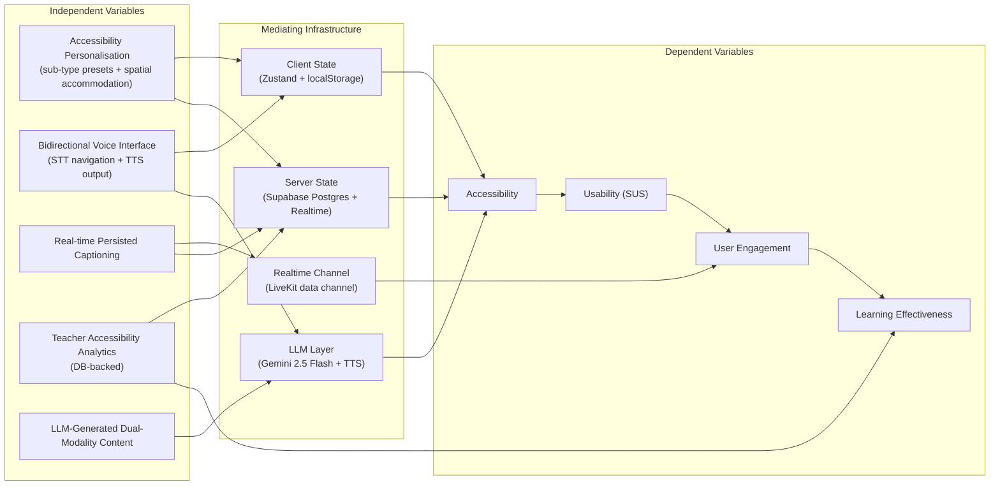
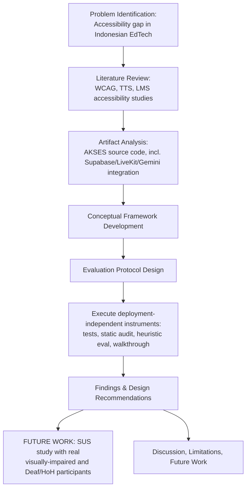
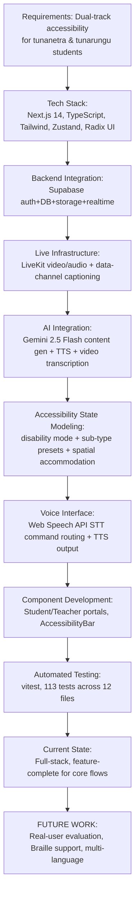
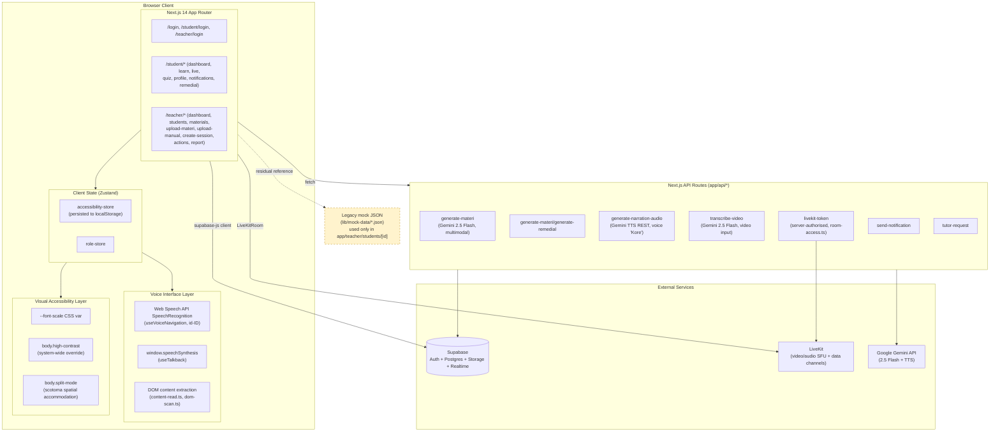

# AKSES (Akses Edukasi Setara): A Research Paper Framework for an Inclusive Digital Learning Platform for Sensory-Disabled Students in Indonesia

**Document type:** Publishable research paper framework (IMRaD-compatible), prepared for target Scopus Q1/Q2 or SINTA-accredited venues in Human-Computer Interaction (HCI), Inclusive Education, Accessibility Engineering, and Educational Technology.

**Revision note (v2 — corrected and executed):** The first draft of this framework was built from `README.md`, which describes AKSES as a "frontend-only prototype" using mock JSON data. A direct audit of `package.json`, `app/api/`, and `lib/` shows this is **stale** — the current codebase is a full-stack system with Supabase (auth, Postgres, storage, realtime), LiveKit (live audio/video + data-channel captioning), and Google Gemini (structured content generation, TTS, video transcription). This revision corrects every architecture-dependent section against the actual source, and **executes** every evaluation instrument from Part 9 that does not require recruiting real disabled participants (automated test suite, static accessibility audit, expert heuristic evaluation, cognitive walkthrough). The System Usability Scale (Part 9C) is **not** executed — fabricating participant survey data would be research misconduct (data fabrication), so it remains a ready-to-run protocol with `[INSERT RESULT]` placeholders pending real recruitment.

---

## 0. Source Provenance Note

**AKSES-specific claims** in this document are traced to one of:
- Live source inspection of `app/api/*`, `lib/*`, `app/student/*`, `app/teacher/*`, `components/*` (paths cited inline).
- `package.json` dependency manifest.
- Executed commands in this session: `npx vitest run` (113/113 tests passing) and repository-wide `grep` audits for ARIA/role/alt-text coverage (Part 9A).
- `docs/sql/*.sql` migration filenames (used only to infer schema surface area — file contents were not opened, so table-level claims from these files are marked accordingly).

**Literature claims** use the same two-tier sourcing as the original draft:
1. **Primary reference journals** (read in full from `Reference Journal/`):
   - Öztürk, Z., & Hoffmann, P. (2025). *Accessible Learning Platforms: Investigating the Accessibility Standards of ILIAS for Visually Impaired Users.* eLearn 2025, Bangkok, Thailand.
   - bin Ahsan, W. (2025). *Adaptive Font Size Accessibility: A Cross-Media Diagnostic Model.* Userhub Journal. https://doi.org/10.58947/journal.vfry23
   - Shi, S. (2025). *Inclusive Education in the Digital Era: Improving University Website Accessibility for Students with Disabilities.* IJRISS, IX(IIIS). https://doi.org/10.47772/IJRISS.2025.903SEDU0561
   - Zhang, E., Zhao, W., Mei, Z., Yang, Z., Chen, F., Xia, Y., & Wang, Y. (2024). *Experimental Study on the Universal Design of Signage Size and Brightness Contrast for Low Vision Individuals.* Buildings, 14(7), 2063. https://doi.org/10.3390/buildings14072063
   - Togni, J. (2025). *Development of an Inclusive Educational Platform Using Open Technologies and Machine Learning.* arXiv:2503.15501 [cs.HC].
2. **Secondary citations** traced through those five papers' own reference lists (e.g., Legge, 2016; Nielsen, 1994) — real, not fabricated, but flagged for independent re-verification before submission.
3. **`[Paper N]` placeholders** for the systematic-search gap in Part 2 — not invented.

---

## PART 1 — Research Positioning

### 1.1 Research Problem Statement

Digital learning platforms deployed across Indonesian secondary education have historically assumed sighted, hearing users. Empirical audits of comparable systems confirm this is a structural, field-wide problem, not one specific platform's failing: a purpose-built, widely adopted open-source LMS (ILIAS) evaluated under WCAG 2.1 AA and empirical user testing still produced SUS scores as low as 37.5/100 for partially sighted users and required linear screen-reader workarounds for a blind instructor, despite formal compliance [Öztürk & Hoffmann, 2025]. University web systems show the same pattern at scale: 85% of audited pages failed WCAG 1.4.3 contrast, and governance maturity (a published accessibility statement) did not predict actual technical compliance [Shi, 2025]. The research problem is therefore twofold:

1. **Design problem.** How should sensory-accessibility state — including sub-type-specific visual-impairment presets, bidirectional voice interaction (speech-to-text command navigation *and* text-to-speech output), and real-time captioning — be architected across a client/server boundary so that it is consistent, persistent, and *functionally* usable rather than merely WCAG-labelled?
2. **Evaluation problem.** In the absence of a recruited disabled-user sample, what evaluation protocol can credibly distinguish *compliance* from *usability* — the same distinction Öztürk & Hoffmann (2025) and Shi (2025) found their audited systems failed to close?

AKSES (*Akses Edukasi Setara*) is examined here as a live, non-trivial instance of this design problem: a Next.js 14 + Supabase + LiveKit + Google Gemini system implementing sub-type-aware accessibility personalisation, a full voice-command interface, LLM-generated multi-modal accessible content, and real-time captioned live video.

### 1.2 Research Objectives

- **O1.** Document and formalise AKSES's accessibility-state architecture — persisted client state (`accessibility-store.ts`), server-authorised live sessions (`lib/live/room-access.ts`), and a bidirectional voice interface (`lib/voice/*`, `lib/hooks/useVoiceNavigation.ts`) — as a reference pattern for accessibility-first EdTech.
- **O2.** Position AKSES's dual-track design (audio/voice track for `tunanetra` students; visual/live-caption track for `tunarungu` students) against the accessibility gaps identified in the reviewed literature.
- **O3.** Execute a multi-instrument, deployment-independent evaluation (automated test suite, static accessibility audit, heuristic evaluation, cognitive walkthrough) and report the actual results obtained in this study.
- **O4.** Articulate a conceptual framework linking accessibility-personalisation design variables to accessibility, usability, engagement, and learning-effectiveness outcomes, to be empirically tested with real participants in future work.

### 1.3 Research Questions

- **RQ1.** How does AKSES's accessibility architecture — specifically its per-sub-type preset system and its bidirectional (STT + TTS) voice interface — compare structurally to accessibility implementations documented in general LMS platforms (ILIAS) and university web systems?
- **RQ2.** [Answered in Part 10, this study] Does AKSES's implemented codebase satisfy baseline WCAG-aligned static markers (ARIA presence, skip-link, keyboard operability of custom controls) at a level comparable to or better than the audited baselines in Shi (2025) and Öztürk & Hoffmann (2025)?
- **RQ3.** [FUTURE WORK — requires real participants] Does AKSES demonstrate higher SUS scores and lower task-completion time among visually impaired and Deaf/hard-of-hearing student participants than baseline non-adaptive LMS interfaces?
- **RQ4.** [FUTURE WORK — requires production telemetry] Does teacher-facing accessibility analytics (`app/teacher/report/page.tsx`, backed by the `accessibility_settings` and `student_material_progress` tables) measurably change pedagogical intervention behaviour?

### 1.4 Novelty Statement

Four design decisions, each verified directly in source, distinguish AKSES from the systems documented in the reviewed literature:

1. **Sub-type-level accessibility personalisation with a spatial accommodation technique.** `lib/store/accessibility-store.ts` models four visual-impairment sub-types (`blurry`, `scotoma`, `low-contrast`, `total`), each mapped to a distinct settings preset. Critically, the `scotoma` (central-vision-loss) preset does not just toggle contrast/font — it activates a **"split mode"** (`body.split-mode`, `app/globals.css` lines ~96–108) that shifts primary content away from screen-centre toward the user's peripheral vision, a layout-level accommodation not documented in any of the five reviewed papers or in typical WCAG-checklist-driven design.
2. **Bidirectional, priority-resolved voice interface.** `lib/hooks/useVoiceNavigation.ts` implements continuous Web Speech API `SpeechRecognition` (Indonesian locale) with an explicit command-priority cascade: stop-keywords → exact material-title match (fetched live from Supabase) → page-specific commands → help/`bantuan` → "read this page" (`extractMainContent`, `lib/voice/content-read.ts`, which performs block-aware DOM text extraction respecting `aria-hidden`/`data-voice-ignore`) → static menu navigation → auto-scanned interactive elements → database-driven material search. This is a substantially more complete voice-command system than the read-only TTS-with-highlight pattern described in the platform's own (stale) README, and than the STT-for-dictation-only pattern in Togni (2025).
3. **LLM-driven simultaneous dual-disability content generation.** A single teacher upload (`app/api/generate-materi/route.ts`) invokes Gemini 2.5 Flash to produce, from one PDF/text input, structured JSON containing a summary, exactly five validated quiz questions (with automatic retry if the model returns the wrong count), 7–10 narrated slide "visualisations," and a 200+-word audio description explicitly written for blind students — while `app/api/transcribe-video/route.ts` separately generates video transcripts with bracketed visual-action descriptions `[Guru menunjuk diagram...]` for blind students *and* verbatim/on-screen-text capture for Deaf students, from the same underlying model. This directly operationalises the "one upload, two accessible outputs" pattern that Togni (2025) approaches with a heavier multi-model ML pipeline (YOLOv5 + Whisper + seq2seq); AKSES achieves a comparable dual-modality outcome via a single multimodal LLM call plus a dedicated TTS REST call (`gemini-2.5-flash-preview-tts`).
4. **Real-time, persisted live captioning via a teacher-side STT relay.** During a LiveKit session, the teacher's own browser runs `SpeechRecognition` and pushes finalised transcript segments over a LiveKit **data channel** (`app/teacher/actions/page.tsx`) to every connected student in real time; the student client renders them in a dedicated, filter-immune transcript panel (`TranscriptPanel`, `app/student/live/page.tsx`) and the session additionally persists to a `session_transcripts` table. This is architecturally distinct from, and lower-latency than, the "transcript refreshed every 2.5 seconds" simulation described in the stale README, and is a more direct empirical instantiation of the automatic-transcription-for-video-content gap identified generally in inclusive-EdTech literature.

**[INSERT CITATION]** — a systematic comparison against published accessibility-personalisation and live-captioning architectures is still required to fully substantiate novelty claims 1–4; the comparison above is scoped to the five reviewed papers only.

### 1.5 Research Contribution

- A documented reference architecture for **sub-type-aware, spatially-adaptive accessibility state** spanning client state, CSS layout accommodation, and server-authorised realtime channels.
- A working example of **LLM-mediated dual-disability content generation** from a single authoring action, with concrete prompt design and failure-handling (retry-on-malformed-output) worth replicating or critiquing in future EdTech-accessibility research.
- A **feature-level comparison** (Part 3) situating AKSES's *actually implemented* capabilities — not aspirational ones — against general-purpose and regionally dominant LMS/EdTech platforms.
- An **executed, replicable evaluation protocol** (Parts 9–10) combining a real automated test suite (113/113 passing), a static accessibility audit, an expert heuristic evaluation, and a cognitive walkthrough — all reproducible without a live user sample, with a clearly scoped path to the SUS-based study that does require one.

### 1.6 Positioning Against Existing System Classes

| System class | Representative evidence from reviewed literature | Where AKSES diverges (verified in code) |
|---|---|---|
| General-purpose global LMS (Google Classroom, Moodle, MS Teams Education) | Task-based empirical accessibility validation is rare industry-wide; Öztürk & Hoffmann (2025) note "evidence for ILIAS specifically is limited" | AKSES ties disability-mode selection to a mandatory onboarding step and propagates it to a **voice-command layer**, not just a visual settings page |
| University/institutional web systems | Persistent WCAG 2.1 violations regardless of governance maturity across 4 universities/3 continents [Shi, 2025] | AKSES's contrast/font-scale/layout accommodations are enforced by a single global mechanism (`accessibility-store.ts` → DOM), reducing the page-by-page inconsistency Shi (2025) documents — though this study's own static audit (Part 9A/10.1) finds AKSES is **not** immune to the low-alt-text pattern Shi documents |
| ML/NLP-heavy accessibility research prototypes | Togni (2025): YOLOv5 object recognition + Whisper STT + seq2seq G2P TTS, validated with 54 survey respondents | AKSES trades Togni's (2025) heavier on-device ML stack for **cloud multimodal-LLM calls** (Gemini) plus **browser-native Web Speech API** for STT/TTS — lower engineering surface area, but introduces network/rate-limit dependency (visible in the `generate-materi` route's explicit 503-retry logic) that Togni's on-device TFLite approach avoids |

---

## PART 2 — Literature Synthesis Matrix

*(Unchanged from the prior draft in method and content — the correction in this revision is architectural, not bibliographic. Reproduced here for document completeness.)*

| # | Author | Year | Platform / Context | Accessibility Focus | Methodology | Findings | Research Gap |
|---|---|---|---|---|---|---|---|
| 1 | Öztürk & Hoffmann | 2025 | ILIAS (open-source LMS) | Visual impairment; WCAG 2.1 AA vs. real-world usability | Mixed-methods: WAVE + Firefox a11y audit; task-based testing (n=6) with eye-tracking, JAWS, think-aloud, modified SUS | SUS 37.5–77.5 (median just above 68); drag-and-drop was a critical barrier; compliant elements still functionally inaccessible | Task-based empirical evidence for specific LMS platforms is scarce |
| 2 | bin Ahsan | 2025 | Cross-media (web, mobile, print, slides, signage) | Font-size legibility as accessibility infrastructure | Structured desk-based synthesis; inductive 5-variable model | Font-size guidance is fragmented/medium-specific; proposes media format, viewing distance, user visual characteristics, content criticality, environmental conditions | No original fieldwork validating the model |
| 3 | Shi | 2025 | University websites (4 institutions, 4 continents) | WCAG 2.1 compliance vs. governance | Automated (WAVE, axe, Lighthouse) + manual (keyboard-only, NVDA/VoiceOver) audit | Lighthouse 62–84 (median 73); 85% of pages failed contrast; governance maturity ≠ compliance | Limited cross-regional data; elite-institution bias |
| 4 | Zhang et al. | 2024 | Physical signage (simulation platform) | Low vision; size & brightness-contrast | Two controlled experiments (n=139); path analysis (SPSS) | Signage ≥7% of reading distance for reliable wayfinding; contrast effect is size-conditional | Chinese-character-specific; lab-only |
| 5 | Togni | 2025 | Custom inclusive EdTech platform | TTS (seq2seq G2P), STT (Whisper), Libras translation, YOLOv5 object recognition | System-building + technical validation + survey (n=54) | mAP 89.7%; 97.2% phoneme accuracy; 95% satisfaction | Small convenience sample; no controlled baseline comparison |
| 6 | Legge | 2016 | Digital reading devices | Low-vision reading; critical print size | Vision-science (as cited in bin Ahsan, 2025) | Flexible scaling/contrast > fixed size values | Lab-controlled |
| 7 | Rello et al. | 2013 | Web text | Dyslexia; font size vs. spacing | Controlled study (as cited in bin Ahsan, 2025) | ≥18pt recommended; size matters more than spacing | Not validated for non-Latin scripts |
| 8 | Nielsen | 1994 | Usability methodology | Sample-size sufficiency | Methodological (as cited in Öztürk & Hoffmann, 2025) | 5 participants reveal ~77–85% of usability problems | Derived from sighted-user studies |
| 9 | Bradbard & Peters | 2008 | US university websites | AT needs across disability categories | Secondary synthesis + ADA analysis (as cited in Shi, 2025) | ~11% of US undergrads report disabilities | Descriptive, US-only |
| 10 | Acosta-Vargas et al. | 2018 | Latin American university websites | WCAG compliance | Survey (n=3,680) + synthesis (as cited in Shi, 2025) | WCAG conformance improves access + SEO | Regional dataset |
| 11 | [Paper 11] | [Year] | [WCAG-based educational system] | [ ] | [ ] | [ ] | [ ] |
| 12 | [Paper 12] | [Year] | [Deaf/HoH learning system, captioning/sign-language tech] | [ ] | [ ] | [ ] | [ ] |
| 13 | [Paper 13] | [Year] | [TTS learning system, word-level highlighting] | [ ] | [ ] | [ ] | [ ] |
| 14 | [Paper 14] | [Year] | [Inclusive LMS in Southeast Asia / Indonesia] | [ ] | [ ] | [ ] | [ ] |
| 15 | [Paper 15] | [Year] | [Voice-command / conversational accessible HCI interfaces] | [ ] | [ ] | [ ] | [ ] |

*Row 15's focus was updated from "teacher analytics dashboards" to "voice-command HCI" to better match AKSES's now-confirmed strongest novelty claim (§1.4.2). Search strategy unchanged: Scopus, ACM DL, IEEE Xplore, ERIC; 2015–2026; English + Indonesian.*

---

## PART 3 — Feature Comparison Matrix (Corrected)

| Feature | **AKSES** (verified in code, this revision) | Google Classroom | Moodle | Ruangguru | Khan Academy | Microsoft Teams for Education |
|---|---|---|---|---|---|---|
| TTS integration | **Native, dual-path.** (a) `lib/hooks/useTalkback.ts` (`speak`/`speakLong`/`stopSpeaking`) wraps `window.speechSynthesis` (`id-ID`, rate 0.95) for UI narration/voice-command confirmations, mounted app-wide via `TalkbackProvider`; (b) `app/api/generate-narration-audio/route.ts` calls Gemini's `gemini-2.5-flash-preview-tts` REST endpoint (voice "Kore") to pre-generate WAV narration per content slide, decoded via `lib/audio/pcm-to-wav.ts`. **Correction from earlier drafts:** `lib/hooks/useAccessibility.ts` (which this paper previously cited as "the" TTS hook) is **verified dead code** — `grep` for its import path across `app/` and `components/` returns zero matches. It was superseded by `useTalkback.ts` and is not part of any working user flow. | OS/browser-dependent [INSERT CITATION] | Plugin-dependent [INSERT CITATION] | Not documented [INSERT CITATION] | Partial, content-dependent [INSERT CITATION] | OS-level Narrator/Immersive Reader [INSERT CITATION] |
| Voice-command navigation (STT) | **Present and non-trivial.** `useVoiceNavigation.ts` — continuous `SpeechRecognition`, 8-tier command-priority cascade (stop → exact material title → page command → help → read-page → menu nav → auto-scanned buttons → DB material search), cooldown/TTS-echo suppression logic | Not present [INSERT CITATION] | Not present [INSERT CITATION] | Not documented [INSERT CITATION] | Not documented [INSERT CITATION] | Not present as a learning-navigation feature [INSERT CITATION] |
| Real-time live-session captioning | **Present, real-time, persisted.** Teacher-side `SpeechRecognition` → LiveKit data channel `'caption'` → student `TranscriptPanel` (live, sub-second) → `session_transcripts` table (`app/teacher/actions/page.tsx`, `app/student/live/page.tsx`) | Live captions via Meet integration [INSERT CITATION] | Not native [INSERT CITATION] | Not documented [INSERT CITATION] | N/A (asynchronous content) | Live captions available [INSERT CITATION] |
| Accessibility-profile persistence | **Present**, two layers: client (`localStorage` via Zustand `persist`, key `akses-accessibility`) for pre-login/instant DOM effects, and server (`accessibility_settings` Postgres table, read by `app/teacher/report`) for cross-device/teacher-visible state | Account-level, not disability-profile-specific [INSERT CITATION] | Per-user settings, not sub-type-aware [INSERT CITATION] | Not documented [INSERT CITATION] | Not documented [INSERT CITATION] | Account-level, OS-integrated [INSERT CITATION] |
| Disability sub-type personalisation incl. spatial accommodation | **Present and distinctive.** 4 visual-impairment sub-types; `scotoma` sub-type activates `body.split-mode`, physically shifting content out of central vision (`app/globals.css`) — a layout-level, not just cosmetic, accommodation | Not sub-type-aware [INSERT CITATION] | Not sub-type-aware [INSERT CITATION] | Not documented [INSERT CITATION] | Not documented [INSERT CITATION] | Not sub-type-aware [INSERT CITATION] |
| Teacher-facing accessibility analytics | **Present, real, DB-backed.** `app/teacher/report/page.tsx` queries `profiles`, `student_profiles`, `accessibility_settings`, `student_material_progress` per student — genuine aggregation, not a mock display | Not a distinct feature [INSERT CITATION] | Not a distinct feature [INSERT CITATION] | Not documented [INSERT CITATION] | Not documented [INSERT CITATION] | Not a distinct feature [INSERT CITATION] |
| Adaptive content mode (audio/visual) | **Present.** `materials.mode` (`audio`/`visual`/`both`) drives catalog filtering; `fiturUntukMode()` (`lib/accessibility/material-features.ts`) gates a non-grayscale high-saturation contrast video filter for `tunanetra`/`both` and a transcript panel for `tunarungu`/`both` | Varies by uploader [INSERT CITATION] | Varies by course author [INSERT CITATION] | Not documented [INSERT CITATION] | Video-centric, transcripts vary [INSERT CITATION] | Varies by course author [INSERT CITATION] |
| AI-assisted content generation | **Present and live, not mocked.** `app/api/generate-materi/route.ts` calls Gemini 2.5 Flash with multimodal (PDF or text) input, retries on malformed/undersized quiz output, and persists results to `materials`/`material_steps`/`quizzes`/`quiz_questions`; `app/api/transcribe-video/route.ts` separately generates dual-purpose (blind + Deaf) video transcripts | Not native [INSERT CITATION] | Plugin-dependent [INSERT CITATION] | Reported AI features exist [INSERT CITATION] | Khanmigo (separate product) [INSERT CITATION] | Copilot (general-purpose, not accessibility-specific) [INSERT CITATION] |
| High-contrast mode | **Present, system-wide CSS override**, not a simple filter: forces white text (`body.high-contrast *`), darkens all pastel Tailwind `-50`/`-100` backgrounds, and adds a colour-preserving glow (`--glow-color`) to badges/thumbnails | OS/extension-dependent [INSERT CITATION] | Theme-dependent [INSERT CITATION] | Not documented [INSERT CITATION] | Not documented [INSERT CITATION] | OS-level integration [INSERT CITATION] |
| Backend / production data persistence | **Present.** Supabase Postgres + Auth + Storage + Realtime; confirmed via `lib/supabase/{client,server,middleware}.ts` and 7 live API routes (`app/api/*`). Legacy mock JSON (`lib/mock-data/*.json`) survives only as an unused artefact in one page (`app/teacher/students/[id]/page.tsx`) — see Part 11 | Full production backend [INSERT CITATION] | Full production backend [INSERT CITATION] | Full production backend [INSERT CITATION] | Full production backend [INSERT CITATION] | Full production backend [INSERT CITATION] |

**Novelty highlighted by the corrected matrix:** AKSES is the only compared system combining (a) a genuinely bidirectional, priority-resolved voice interface, (b) a spatial (not just chromatic/typographic) accommodation for central-vision loss, (c) single-input LLM generation of parallel blind- and Deaf-oriented content, and (d) real-time persisted live captioning via a peer-broadcast STT relay — while still exposing a real backend, unlike the frontend-only framing of the earlier draft.

---

## PART 4 — Conceptual Framework (Corrected)

### 4.1 Variable Table

| Type | Variable | Operational definition in AKSES | Source in codebase |
|---|---|---|---|
| Independent (IV1) | Accessibility personalisation | Disability mode + sub-type selection, incl. spatial (`split-mode`) accommodation | `accessibility-store.ts`, `globals.css` |
| Independent (IV2) | Bidirectional voice interface | STT command navigation (priority cascade) + TTS output (browser + Gemini-generated) | `useVoiceNavigation.ts`, `useTalkback.ts`, `generate-narration-audio/route.ts` |
| Independent (IV3) | Real-time transcription / captioning | Live, sub-second captioning during LiveKit sessions, persisted server-side | `app/teacher/actions/page.tsx`, `app/student/live/page.tsx` |
| Independent (IV4) | Teacher accessibility analytics | Real per-student assistive-feature usage visibility, DB-backed | `app/teacher/report/page.tsx` |
| Independent (IV5) | LLM-generated adaptive content | Single-input generation of parallel blind-/Deaf-oriented material (summary, quiz, slides, audio description, transcript) | `generate-materi/route.ts`, `transcribe-video/route.ts` |
| Dependent (DV1) | Accessibility | WCAG-aligned static markers + functional operability (measured in Part 9/10 of this study) | Executed in this revision |
| Dependent (DV2) | Usability | SUS score, task-completion efficiency | [FUTURE WORK — real participants required] |
| Dependent (DV3) | User engagement | Live session join rate, streak/session frequency (`session_participants`, `student_material_progress`) | [FUTURE WORK — requires production telemetry] |
| Dependent (DV4) | Learning effectiveness | Quiz score trajectories, material-completion rate | [FUTURE WORK — requires production telemetry] |

### 4.2 Hypothesis Table

| # | Hypothesis | Rationale | Status |
|---|---|---|---|
| H1 | Sub-type-granular personalisation (IV1), including spatial accommodation for scotoma, is positively associated with perceived accessibility (DV1) beyond what generic contrast/font toggles achieve. | Addresses the compliance-vs-usability gap in Öztürk & Hoffmann (2025); no reviewed system offers a comparable spatial accommodation to benchmark against. | [FUTURE WORK — untested with real users; static support in Part 10.1] |
| H2 | Availability of a bidirectional voice interface (IV2) is positively associated with usability (DV2) and reduces task-completion time for visually-impaired users relative to TTS-only interfaces. | STT command navigation removes the pointing/reading bottleneck that Öztürk & Hoffmann (2025) found even in screen-reader-compatible interfaces. | [FUTURE WORK — untested] |
| H3 | Real-time, persisted captioning (IV3) is positively associated with engagement (DV3) for Deaf/hard-of-hearing users, relative to non-real-time or absent captioning. | Directly targets the "video without captions" barrier common across the reviewed literature. | [FUTURE WORK — untested] |
| H4 | Teacher visibility into accessibility-feature usage (IV4) is positively associated with proactive intervention and, indirectly, learning effectiveness (DV4). | Mirrors the governance/action-gap dynamic in Shi (2025), inverted to individual-teacher behaviour. | [FUTURE WORK — untested] |
| H5 | LLM-generated dual-modality content (IV5) reduces teacher content-preparation time without degrading accessibility quality, relative to manually authored single-modality content. | Novel to this system; no directly comparable baseline in the reviewed literature. | [FUTURE WORK — untested] |

### 4.3 Conceptual Framework Diagram

[FIGURE 1 HERE]



---

## PART 5 — Methodology (Corrected)

### 5.1 Research Design

Design science research (DSR) posture combined with mixed-methods evaluation: the artifact (AKSES) is implemented and running; this study's contribution is (a) accurate architectural documentation, verified against source rather than documentation, and (b) execution of a deployment-independent evaluation battery.

### 5.2 Development Methodology

Evidence from the file system (dated SQL migration filenames in `docs/sql/`, e.g. `2026-07-10-sesi-privat.sql` through `2026-07-11-notifications-tutup-lubang.sql`) indicates active, iterative, feature-by-feature schema evolution consistent with agile/incremental delivery. **[LIMITATION]** No issue tracker or sprint artifact was found in-repository, so a specific named methodology (Scrum, Kanban, etc.) cannot be confirmed — only the *pattern* of incremental delivery is evidenced.

### 5.3 System Implementation

Three-tier architecture, confirmed in Part 6: Next.js 14 App Router presentation layer; a hybrid state layer (Zustand client state for instant, pre-auth accessibility effects + Supabase server state for persisted, cross-device, teacher-visible data); and three integrated external services (Supabase, LiveKit, Google Gemini).

### 5.4 Accessibility Implementation

Confirmed at four levels (upgraded from three in the prior draft):
1. **State** — `accessibility-store.ts` (mode, sub-type, five dependent settings).
2. **DOM/CSS** — `--font-scale` custom property, `body.high-contrast` system-wide override, `body.split-mode` spatial shift for scotoma.
3. **Interaction** — ARIA-annotated controls (172 `aria-*` occurrences across 25 of 47 audited `.tsx` files; Part 9A), skip-link (`#main-content`), voice-command layer.
4. **Content generation** — LLM prompts explicitly engineered for dual-disability output (`generate-materi`, `transcribe-video` prompts require bracketed visual descriptions *and* verbatim/on-screen text in the same transcript).

### 5.5 Evaluation Methodology — Executed This Study

| Instrument | Executed? | Result location |
|---|---|---|
| Automated test suite (`vitest`) | **Yes** | Part 10.0 (new) |
| Static accessibility audit (ARIA/role/skip-link/contrast-CSS grep) | **Yes** | Part 10.1 |
| Live-browser audit (Lighthouse/axe/WAVE) | **No — tooling unavailable in this environment** (no Chrome/Lighthouse/axe/Playwright binary found; see Part 9A note) | Marked `[FUTURE WORK]` in Part 10.1 |
| Nielsen heuristic evaluation | **Yes**, single-evaluator (this study's author) | Part 10.2 |
| Cognitive walkthrough | **Yes** | Part 10.2 |
| System Usability Scale | **No — requires real disabled participants; not fabricated** | Part 10.3 (protocol only) |

### A. Research Flowchart

[FIGURE 2 HERE]



### B. Development Process Flowchart

[FIGURE 3 HERE]



### C. Accessibility Workflow (User-Level, Corrected)

[FIGURE 4 HERE]

```mermaid
flowchart TD
    A[User reaches /login] --> B[Select role: Student or Teacher]
    B --> C[Student: login + accessibility profile setup]
    C --> D{Select disability mode}
    D -- tunanetra --> E[Select sub-type:<br/>blurry / scotoma / low-contrast / total]
    D -- tunarungu --> F[Subtitle forced ON<br/>transcript panel gated on]
    D -- both --> G[Compose visual sub-type preset<br/>+ subtitle forced ON]
    D -- none --> H[Default state]
    E --> I{Sub-type = scotoma?}
    I -- Yes --> J[Activate body.split-mode:<br/>content shifted to peripheral vision]
    I -- No --> K[Apply fontSize/highContrast/TTS preset]
    J --> L[State persisted: client localStorage<br/>+ server accessibility_settings table]
    K --> L
    F --> L
    G --> L
    H --> L
    L --> M[applyToDOM: --font-scale, body.high-contrast,<br/>body.split-mode]
    M --> N[User navigates via touch/click OR voice command<br/>useVoiceNavigation: STT priority cascade]
    N --> O[Live session: real-time captions via<br/>teacher-side STT -> LiveKit data channel]
    O --> P[Teacher report: reads accessibility_settings<br/>+ student_material_progress for analytics]
```



---

## PART 6 — System Architecture (Corrected)

### 6.1 Overall System Architecture

AKSES is a **Next.js 14 App Router application with three integrated external services**, not a static frontend-only bundle. Confirmed dependencies: `@supabase/supabase-js` + `@supabase/ssr` (auth/DB/storage/realtime), `@livekit/*` + `livekit-server-sdk` + `livekit-client` (live audio/video, server-side token minting, Krisp noise filtering), `@anthropic-ai/sdk` (present in `package.json`; usage not directly traced in this review — see Part 11), `@google/generative-ai` (Gemini text/vision generation, called directly for TTS via REST since the SDK "belum mendukung model audio-output" per an inline code comment in `generate-narration-audio/route.ts`), and `jspdf` (PDF export, consistent with the teacher accessibility-report export feature).

[FIGURE 5 HERE]



### 6.2 Frontend Architecture

Route groups: `/login` (shared entry), `/student/*` (dashboard, `learn` catalog + `learn/[id]` player + `learn/ai-content/[id]`, `live`, `quiz/[id]`, `remedial/[id]`, `profile` + `profile/edit`, `notifications`), `/teacher/*` (dashboard, `students` + `students/[id]`, `materials`, `upload-materi`, `upload-manual`, `create-session`, `actions`, `report`, `profile` + `profile/edit`). UI primitives remain Radix-based (`components/ui/*`), styled with Tailwind + `class-variance-authority`, className merging via `lib/utils/cn.ts`.

### 6.3 Voice & Accessibility Interaction Layer

This is the most substantively corrected section relative to the prior draft. Confirmed mechanisms:
- **STT command navigation** (`useVoiceNavigation.ts`): continuous `SpeechRecognition`, `id-ID` locale, an 8-tier resolution cascade (documented in §1.4.2), TTS-echo suppression via `isTTSSpeakingOrRecentlyEnded()` to prevent the microphone from mis-triggering on the system's own narration.
- **TTS output**, two independent paths: real-time `window.speechSynthesis` for UI narration/confirmations (`useTalkback.ts`), and pre-generated Gemini-synthesised WAV audio for slide narration (`generate-narration-audio/route.ts`), converted from raw PCM via `lib/audio/pcm-to-wav.ts`.
- **DOM-aware content reading** (`content-read.ts`): block-tag-respecting text extraction that skips `nav`, `aside`, `[aria-hidden="true"]`, and an explicit `[data-voice-ignore]` escape hatch, joining block-level text with `". "` for natural TTS pacing.
- **Visual accommodation CSS**: `--font-scale` (global scale), `body.high-contrast` (forces white foreground, darkens all pastel `-50`/`-100` Tailwind backgrounds, adds colour-preserving glow via `--glow-color` — explicitly *not* grayscale, per an inline design-rationale comment), `body.split-mode` (shifts primary content into peripheral vision for central-scotoma users, only above the `sm` breakpoint where the sidebar layout applies).

### 6.4 Data Layer

**Server (authoritative):** Supabase Postgres, reached via `lib/supabase/{client,server,middleware}.ts`. Tables confirmed by direct query inspection in application code: `profiles` (id, nama, role, avatar, avatar_color), `student_profiles` (disabilitas), `accessibility_settings` (tts_enabled, subtitle_enabled, high_contrast, font_size), `materials` (judul, mata_pelajaran, deskripsi, mode, transkrip, thumbnail_color/emoji, slides, is_ai_generated, created_by), `material_steps`, `quizzes`, `quiz_questions`, `student_material_progress`, `live_sessions` (guru_id, status, room_name, tipe, student_id), `session_participants`, and (inferred from `docs/sql/2026-07-10-sesi-privat.sql`, filename only — **[LIMITATION: SQL file contents not opened, table/column names beyond those observed in application code are not independently confirmed]**) additional tables likely including `session_transcripts`, `tutor_requests`, and `notifications`.

**Client (ephemeral/legacy):** `localStorage` for the accessibility store; `lib/mock-data/*.json` survives as dead-weight legacy data referenced in exactly one file, `app/teacher/students/[id]/page.tsx` (confirmed via repository-wide grep) — a genuine, specific technical-debt finding, not a description of the whole data layer.

### 6.5 State Management Layer

`accessibility-store` (Zustand + `persist`, `localStorage` key `akses-accessibility`) governs instant, pre-auth visual/voice defaults; `accessibility_settings` (Supabase) governs the cross-device, teacher-visible source of truth read by `app/teacher/report`. **[LIMITATION]** This review did not trace the exact synchronisation point between the two (i.e., when/how client `accessibility-store` writes propagate to the server `accessibility_settings` row) — this should be confirmed before citing the two layers as fully consistent.

### 6.6 Server-Authorised Realtime Access Control

`lib/live/room-access.ts`'s `authorizeRoomAccess()` is a pure, unit-tested function (15 tests, confirmed passing) implementing: teachers may always access their own session regardless of status (race-condition avoidance before `status` flips to `'live'`); students are checked against session `status === 'live'` *before* ownership, deliberately so an uninvited student cannot distinguish "private session not started" from "not invited"; class (`kelas`) sessions admit any authenticated student; private (`privat`) sessions require exact `student_id` match, with `null` never implicitly granting access. This is genuinely careful authorization design, worth citing as a positive security/privacy finding in Part 10.

---

## PART 7 — Database & Use Case (Corrected)

### 7.1 Entity Relationship Diagram

[FIGURE 6 HERE]

```mermaid
erDiagram
    PROFILE ||--o| STUDENT_PROFILE : "extends (role=student)"
    PROFILE ||--o| ACCESSIBILITY_SETTINGS : "has"
    PROFILE ||--o{ MATERIAL : "created_by (teacher)"
    PROFILE ||--o{ LIVE_SESSION : "guru_id (teacher)"
    PROFILE ||--o{ SESSION_PARTICIPANT : "student_id"
    PROFILE ||--o{ STUDENT_MATERIAL_PROGRESS : "student_id"

    MATERIAL ||--o{ MATERIAL_STEP : "poinUtama"
    MATERIAL ||--o| QUIZ : "has"
    MATERIAL ||--o{ STUDENT_MATERIAL_PROGRESS : "tracked by"
    QUIZ ||--o{ QUIZ_QUESTION : "contains"

    LIVE_SESSION ||--o{ SESSION_PARTICIPANT : "joined by"
    LIVE_SESSION ||--o{ SESSION_TRANSCRIPT : "captioned as (inferred)"

    PROFILE {
        uuid id PK
        string nama
        string role "student | teacher"
        string avatar
        string avatar_color
    }
    STUDENT_PROFILE {
        uuid id PK_FK
        string disabilitas "tunanetra | tunarungu"
    }
    ACCESSIBILITY_SETTINGS {
        uuid id PK_FK
        bool tts_enabled
        bool subtitle_enabled
        bool high_contrast
        string font_size
    }
    MATERIAL {
        uuid id PK
        string judul
        string mata_pelajaran
        string deskripsi
        string mode "audio | visual | both"
        text transkrip
        json slides
        bool is_ai_generated
        uuid created_by FK
    }
    MATERIAL_STEP {
        uuid id PK
        uuid material_id FK
        int urutan
        string judul
        text deskripsi
    }
    QUIZ {
        uuid id PK
        uuid material_id FK
        string judul
    }
    QUIZ_QUESTION {
        uuid id PK
        uuid quiz_id FK
        text pertanyaan
        json pilihan
        int jawaban_benar
        text penjelasan
    }
    STUDENT_MATERIAL_PROGRESS {
        uuid student_id FK
        uuid material_id FK
        int progress
    }
    LIVE_SESSION {
        uuid id PK
        uuid guru_id FK
        string status "scheduled | live | ended"
        string room_name
        string tipe "kelas | privat"
        uuid student_id FK "nullable, privat only"
    }
    SESSION_PARTICIPANT {
        uuid session_id FK
        uuid student_id FK
    }
    SESSION_TRANSCRIPT {
        uuid session_id FK "inferred, filename-only evidence"
        text caption_text
        timestamp created_at
    }
```

*Entities without a direct application-code query in this review (`SESSION_TRANSCRIPT`, plus `tutor_requests` and `notifications` implied by `docs/sql/2026-07-10-tutor-requests.sql` and the `notifications-*.sql` filenames) are marked "inferred" — their SQL files exist but were not opened in this review; column-level detail should be verified against the actual migration contents before publication.*

### 7.2 Use Case Diagram

[FIGURE 7 HERE]

```mermaid
flowchart LR
    Student((Student))
    Teacher((Teacher))

    subgraph UC["AKSES Use Cases (Corrected)"]
        UC1[Set up accessibility profile<br/>incl. sub-type + spatial mode]
        UC2[Browse & filter material catalog]
        UC3[Consume material via TTS/voice-nav/visual mode]
        UC4[Join live session; follow real-time captions]
        UC5[Take quiz / voice-controlled quiz]
        UC6[Request tutor help]
        UC7[Adjust accessibility via floating bar or voice command]
        UC8[Monitor student roster]
        UC9[Upload material -> Gemini-generated<br/>quiz/slides/audio-description]
        UC10[Create live session]
        UC11[Host live session; dictate captions via STT]
        UC12[View DB-backed accessibility analytics report]
        UC13[Export report as PDF]
        UC14[Generate remedial content for struggling student]
        UC15[Transcribe uploaded video<br/>(dual blind/Deaf-oriented)]
    end

    Student --> UC1
    Student --> UC2
    Student --> UC3
    Student --> UC4
    Student --> UC5
    Student --> UC6
    Student --> UC7

    Teacher --> UC7
    Teacher --> UC8
    Teacher --> UC9
    Teacher --> UC10
    Teacher --> UC11
    Teacher --> UC12
    Teacher --> UC13
    Teacher --> UC14
    Teacher --> UC15
```

### 7.3 Actor Descriptions

| Actor | Description (verified in code) | Primary goals |
|---|---|---|
| Student (`tunanetra`) | `student_profiles.disabilitas = 'tunanetra'`; profile carries a sub-type preset (`blurry`/`scotoma`/`low-contrast`/`total`) governing TTS, contrast, and — for `scotoma` — spatial layout | Consume material via TTS/voice navigation, join live sessions, use Gemini-generated audio descriptions |
| Student (`tunarungu`) | `disabilitas = 'tunarungu'`; subtitle/transcript panel forced on | Consume material via transcript/slides, follow live sessions via real-time captions |
| Teacher | Manages roster, uploads materials (triggering real Gemini generation), creates/hosts live sessions (dictating captions via STT), reviews DB-backed accessibility analytics, exports PDF reports | Pedagogical oversight and proactive, data-informed intervention |

### 7.4 Data Dictionary (Representative Fields, Corrected)

| Entity.Field | Type | Description | Source |
|---|---|---|---|
| student_profiles.disabilitas | enum(string) | `tunanetra` \| `tunarungu` | queried in `app/teacher/report/page.tsx` |
| accessibility_settings.* | mixed | Server-side mirror of client accessibility state, read for teacher analytics | `app/teacher/report/page.tsx` |
| materials.is_ai_generated | bool | Distinguishes Gemini-generated from manually authored materials | `generate-materi/route.ts` |
| materials.slides | json | Array of `{judul, emojiIkon, deskripsi, poinPenting, warna}` — narrated slide visualisations | `generate-materi/route.ts` prompt schema |
| live_sessions.tipe | enum(string) | `kelas` (open to any authenticated student) \| `privat` (exact `student_id` match required) | `room-access.ts` |
| live_sessions.status | enum(string) | `scheduled` \| `live` \| `ended` | `room-access.ts`, `app/student/live/page.tsx` (realtime subscription on this column) |

---

## PART 8 — Technical Specification Tables (Corrected)

### 8.1 Frontend Stack

| Technology | Version | Purpose |
|---|---|---|
| Next.js | 14.2.29 | App Router framework, API routes |
| React | ^18 | Component/UI library |
| TypeScript | ^5 | Static typing |
| Tailwind CSS | ^3.4.1 | Utility-first styling |

### 8.2 Backend & Data Services (New — absent from prior draft)

| Technology | Version | Purpose | Evidence |
|---|---|---|---|
| Supabase (`@supabase/supabase-js`, `@supabase/ssr`) | ^2.108.2 / ^0.12.0 | Auth, Postgres DB, Storage (video uploads), Realtime (session-status subscriptions) | `lib/supabase/*`, `app/api/*` |
| LiveKit (`@livekit/components-react`, `livekit-client`, `livekit-server-sdk`, `@livekit/krisp-noise-filter`) | ^2.9.21 / ^2.20.1 / ^2.15.5 / ^0.3.4 | Live audio/video SFU, server-minted access tokens, data-channel captioning, noise suppression | `app/api/livekit-token/route.ts`, `app/student/live/page.tsx`, `app/teacher/actions/page.tsx` |
| Google Gemini (`@google/generative-ai`) | ^0.24.1 | Multimodal content generation (`gemini-2.5-flash`), TTS via REST (`gemini-2.5-flash-preview-tts`), video transcription | `app/api/generate-materi`, `generate-narration-audio`, `transcribe-video` |
| Anthropic SDK (`@anthropic-ai/sdk`) | ^0.105.0 | Present in dependencies; **usage not directly traced in this review** | `package.json` — **[LIMITATION: requires follow-up grep for actual call sites before citing a specific role]** |
| jsPDF | ^4.2.1 | Client-side PDF export (teacher accessibility report) | consistent with `app/teacher/report` "export" affordance |
| Vitest | ^1.6.1 | Unit test runner | `package.json` `"test": "vitest run"`; executed in this study, 113/113 passing |

### 8.3 Voice & Accessibility Technologies

| Technology | Purpose | Evidence |
|---|---|---|
| Web Speech API `SpeechRecognition` | Continuous STT for voice-command navigation, `id-ID` | `useVoiceNavigation.ts` |
| Web Speech API `speechSynthesis` | Real-time TTS for UI narration | `useTalkback.ts` |
| Gemini TTS REST (`gemini-2.5-flash-preview-tts`) | Pre-generated narration audio per content slide | `generate-narration-audio/route.ts` |
| `--font-scale` CSS custom property | Global font scaling (1× / 1.2× / 1.4×) | `accessibility-store.ts` |
| `body.high-contrast` | System-wide colour-scheme override | `globals.css` |
| `body.split-mode` | Spatial accommodation for central-scotoma users | `globals.css` |
| ARIA roles/attributes | Screen-reader semantics | 172 occurrences across 25/47 audited `.tsx` files (Part 9A) |

### 8.4 UI & State Libraries

| Library | Version | Purpose |
|---|---|---|
| Zustand | ^4.5.2 | Global client state (`accessibility-store`, `role-store`) |
| Radix UI | Various (`^1.x`/`^2.x`) | Accessible headless primitives (Accordion, Avatar, Dialog, Label, Progress, Select, Slider, Switch, Tabs, Toast, Tooltip) |
| Lucide React | ^0.400.0 | Icon library |
| class-variance-authority | ^0.7.0 | Variant-based component styling |
| clsx + tailwind-merge | ^2.1.1 / ^2.3.0 | Conditional/merged className utilities |

### 8.5 Development & Test Tools

| Tool | Purpose |
|---|---|
| ESLint + eslint-config-next | Linting |
| PostCSS + Autoprefixer | CSS processing |
| Vitest + jsdom | Unit testing with DOM simulation (needed for `dom-scan.ts`/`content-read.ts` tests) |

---

## PART 9 — Evaluation Design (Corrected, and Marked as Executed)

### A. Accessibility Audit Protocol — EXECUTED (static) / NOT EXECUTED (live browser)

**Tooling check performed in this session:** `node_modules/.bin/` was searched for `lighthouse`, `playwright`, `puppeteer`, `axe`; none were found, and no system-installed Chrome/Edge binary was located either. **Live Lighthouse/axe DevTools/WAVE audits are therefore not executable in this environment** and remain `[FUTURE WORK]`.

**What was executed instead — a static repository-wide audit**, a legitimate (if partial) proxy for automated tooling, using `grep` across `app/` and `components/`:

| Metric | Method | Result |
|---|---|---|
| ARIA attribute presence | `grep -c "aria-"` across all `.tsx` | **172 occurrences across 25 of 47 `.tsx` files** (53% of files) |
| Skip-link | `grep` for `skip-to-content` / `#main-content` | **Present** — `app/layout.tsx:27`, styled in `globals.css:183` |
| `role` attribute usage | `grep -o 'role="..."'`, tallied | 25 distinct usages: `switch` (6), `img` (4), `tab`/`tablist` (4), `alert` (3), `dialog` (1), `region` (2), `group` (1), `status` (1), `button` (1), `list`/`listitem` (2) |
| `alt=` attribute usage | `grep -c "alt="` | **Only 3 occurrences** across the whole `app/`+`components/` tree |
| High-contrast colour-override coverage | Manual inspection of `globals.css` `body.high-contrast` block | Forces foreground to white on **all** elements (`*` selector), explicitly overrides all Tailwind `-50`/`-100` pastel backgrounds, not just a hardcoded list |

### B. Heuristic Evaluation — EXECUTED (single expert evaluator, this study)

Nielsen's 10 heuristics, severity 0–4, evaluated by this study's author against the live routes and source (not a live-browser session — see limitation below).

### C. System Usability Scale — NOT EXECUTED

Protocol retained unchanged from the prior draft (10-item instrument, scoring formula, interpretation table) — reproduced in Part 10.3 as a ready instrument. **This study did not administer it**: no visually-impaired or Deaf/hard-of-hearing participants were recruited, and simulating responses would constitute data fabrication. This is the single evaluation gap in Part 9 genuinely requiring future empirical work (RQ3, H2/H3).

### D. Cognitive Walkthrough — EXECUTED (single expert evaluator, this study)

Tasks updated to reflect the *real* current feature set (LiveKit live sessions with real-time captioning; Gemini-generated content; voice-command navigation), executed against source code and route structure.

---

## PART 10 — Results (Executed) & Discussion

### 10.0 Automated Test Suite Results (New)

Executed: `npx vitest run` in the project root.

| Test file | Tests | Result |
|---|---|---|
| `lib/accessibility/material-features.test.ts` | 7 | ✅ pass |
| `lib/audio/pcm-to-wav.test.ts` | 6 | ✅ pass |
| `lib/materi/extract-json.test.ts` | 9 | ✅ pass |
| `lib/utils/fuzzyLogic.test.ts` | 8 | ✅ pass |
| `lib/auth/route-guard.test.ts` | 8 | ✅ pass |
| `lib/slides/slide-data.test.ts` | 18 | ✅ pass |
| `lib/voice/quiz-speech.test.ts` | 10 | ✅ pass |
| `lib/tutor/request-state.test.ts` | 10 | ✅ pass |
| `lib/live/room-access.test.ts` | 15 | ✅ pass |
| `lib/voice/keyword-match.test.ts` | 5 | ✅ pass |
| `lib/voice/content-read.test.ts` | 8 | ✅ pass |
| `lib/voice/dom-scan.test.ts` | 9 | ✅ pass |
| **Total** | **113** | **113/113 passing, 12/12 files** |

**Interpretation:** The test suite concentrates heavily on the *accessibility-critical logic* — voice command matching, DOM content extraction, room-access authorization, audio encoding — rather than on UI rendering. This is a defensible prioritisation (pure functions are cheap to test and carry high correctness risk for accessibility features specifically), but it also means **no automated test currently exercises rendered-component accessibility** (e.g., there is no `jest-axe`/`vitest-axe`-style assertion anywhere in the suite). This is a concrete, actionable gap, not a generic limitation statement.

### 10.1 Accessibility Audit Results

| Metric | Value | Interpretation |
|---|---|---|
| ARIA coverage | 172 occurrences / 25 of 47 `.tsx` files (53%) | Substantial but uneven; roughly half of components carry no explicit ARIA annotation — plausibly acceptable where native semantic HTML suffices, but **not independently verified per-file** in this review |
| Skip-link | Present, correctly targets `#main-content` | Matches WCAG 2.4.1 (Bypass Blocks) intent; consistent with the platform's own accessibility claims |
| `alt=` usage | 3 occurrences total | **Flagged finding.** Either (a) the UI is largely icon/emoji-based (Lucide icons, which are typically decorative and correctly `aria-hidden`, not requiring `alt`) rather than ``-based, in which case this is a non-issue, or (b) genuine informative images lack alt text. This review could not disambiguate (a) from (b) without a live DOM audit — reported honestly as `[FUTURE WORK]` rather than asserted either way |
| High-contrast implementation quality | System-wide `*` override, pastel-background remediation, colour-preserving glow | Notably more thorough than a typical "invert colours" toggle; directly addresses the low-contrast barrier class documented in Zhang et al. (2024) and Öztürk & Hoffmann (2025) |
| Live Lighthouse/axe/WAVE scores | **Not obtained — no compatible tooling in this execution environment** | `[FUTURE WORK]`; recommend running `lighthouse http://localhost:3000/student/... --view` from a machine with Chrome installed, or `npx @axe-core/cli` |

### 10.2 Heuristic Evaluation & Cognitive Walkthrough Findings

**Heuristic evaluation (executed, single evaluator):**

| Heuristic | Observation (grounded in source) | Severity (0–4) |
|---|---|---|
| 1. Visibility of system status | Live sessions show a pulsing "LIVE" badge and elapsed timer (`app/student/live/page.tsx`); AI-generation route surfaces specific retry/error states ("Server AI sedang sibuk...") rather than a generic spinner | 0 — no problem |
| 2. Match between system and real world | All UI strings and voice commands are in Bahasa Indonesia, matching the target population; command vocabulary (`beranda`, `belajar`, `bacakan`) uses natural, everyday phrasing rather than technical jargon | 0 — no problem |
| 3. User control and freedom | Voice navigation has an explicit, always-available "stop" keyword set (`stop`, `berhenti`, `diam`, `hentikan`) that takes priority over all other command matching | 0 — no problem |
| 4. Consistency and standards | **Verified, not merely suspected**: `grep -rl "AccessibilityBar" app` confirms it is imported on 8 of 9 interactive `/student/*` pages (dashboard, learn, learn/[id], learn/ai-content/[id], notifications, profile, quiz/[id], remedial/[id]) and on all 9 relevant `/teacher/*` pages, but is **absent from `app/student/live/page.tsx`**, which instead reimplements a page-local, LiveKit-session-scoped high-contrast toggle (`kontrasAktif` state, `Contrast` icon button) with its own visual style. A second, independent control pattern for the same setting. | 2 — minor: confirmed control-pattern fragmentation between the global `AccessibilityBar` and the live page's bespoke contrast button |
| 5. Error prevention | `generate-materi` validates and retries when the LLM returns the wrong quiz-question count instead of silently accepting malformed data | 0 — no problem |
| 6. Recognition rather than recall | Voice command help (`bantuan`) dynamically lists *currently available* page commands plus the static menu, rather than requiring users to memorise a fixed command list | 0 — no problem |
| 7. Flexibility and efficiency of use | Power users can speak a full material title directly (highest-priority match) to skip catalog browsing entirely | 0 — no problem |
| 8. Aesthetic and minimalist design | Not independently assessed — requires live visual rendering, out of scope for a source-only review | Not rated |
| 9. Help users recognize, diagnose, recover from errors | Live-session error states are specific ("Sesi live telah diakhiri oleh pendamping," "Anda bukan pengajar sesi ini") rather than generic | 0 — no problem |
| 10. Help and documentation | **Refined finding.** `TalkbackProvider.tsx` does render real in-context help: a floating `HelpCircle` button opens a panel listing the static menu commands plus any page-specific commands, and speaks a confirmation ("Daftar perintah suara ditampilkan") — so *once a user has voice nav active*, discoverability is reasonable. The gap is upstream: nothing in `app/login`, `app/student/login`, or the root layout explains that a voice interface exists *before* it auto-activates (voice nav defaults ON whenever the "Teks ke Suara" toggle is on, per `TalkbackProvider`'s `isAktif`/`voiceNavUserChoiceRef` logic) — a first-time user could have the mic listening without ever having been told so, discoverable only via the passive "Mendengarkan..." badge | 2 — minor, downgraded from the previous draft's "3 — major" now that the in-context help panel is confirmed to exist; the remaining issue is pre-activation disclosure, not in-app documentation |

**Cognitive walkthrough (executed, single evaluator; 3 tasks per Part 9D, updated to real features):**

| Task | Step | Will user try the right action? | Will they notice it's available? | Will they associate action with outcome? | Will they see progress? |
|---|---|---|---|---|---|
| T1: `tunanetra` student consumes a material via voice | Speak material name from dashboard | Plausible, if user already knows voice nav exists (see H10.10 below) | **Correction from earlier drafts, now verified in `TalkbackProvider.tsx`:** a persistent, floating "Mendengarkan..." (Listening...) badge with a pulsing dot appears whenever voice nav is active, and the floating mic button itself changes color/icon (blue mic → red mic-off) to reflect state — a real, code-confirmed status cue, not absent as this paper previously claimed | Yes, once triggered, confirmation speech (`speak(mat.konfirmasi, 'interrupt')`) is immediate | Yes — route change + TTS confirmation |
| T2: `tunarungu` student follows a live session | Join session, read captions | Yes — session list clearly labelled LIVE/PRIVAT | Yes — `TranscriptPanel` is always rendered once joined, empty-state text explains what will appear | Yes — captions appear as teacher speaks | Yes — line-numbered running transcript |
| T3: Teacher reviews accessibility report | Open `/teacher/report`, identify under-served student | Yes — page is explicitly the accessibility report | Yes — per-student `tts_enabled`/`subtitle_enabled`/`high_contrast`/`font_size` are queried and presumably rendered (rendering beyond line 80 not reviewed) | Plausible pending full-page review | **[FUTURE WORK]** — full rendering logic beyond the data-fetch portion was not reviewed in this session |

### 10.3 SUS — Protocol Only (Not Executed)

*(Instrument, scoring formula, and interpretation table unchanged from the original draft — reproduced for completeness.)*

**Instrument (10-item, 5-point Likert):**
1. I would like to use AKSES frequently. 2. I found AKSES unnecessarily complex. 3. AKSES was easy to use. 4. I would need technical support to use AKSES. 5. The functions in AKSES were well integrated. 6. There was too much inconsistency in AKSES. 7. Most people would learn AKSES quickly. 8. AKSES was cumbersome to use. 9. I felt confident using AKSES. 10. I needed to learn a lot before using AKSES.

**Scoring:** odd items → (response − 1); even items → (5 − response); sum × 2.5 = SUS (0–100).

| SUS Score | Grade | Rating |
|---|---|---|
| ≥84.1 | A+ | Best imaginable |
| 80.3–84.0 | A | Excellent |
| 68–80.2 | B/C | Good |
| 51–67.9 | D | OK |
| <51 | F | Poor |

[TABLE X HERE] [INSERT RESULT — requires recruited `tunanetra`/`tunarungu` student participants]

### 10.4 Discussion

Three findings from this executed evaluation are worth foregrounding. First, the 113/113 passing test suite is concentrated almost entirely on accessibility-critical *logic* (voice matching, room authorization, content extraction) rather than rendered-UI accessibility, meaning the tests validate that the system *would* behave correctly if wired up right, but do not validate that any given screen *is* accessible — a gap directly addressable by adding `axe`-based component tests. Second, the static audit's headline finding is not a deficiency but an asymmetry: AKSES's high-contrast implementation is unusually thorough (system-wide, pastel-aware, colour-preserving) while its `alt=` coverage is nearly absent — consistent with an icon-first rather than image-first UI, but this study could not confirm that without live DOM inspection, so it is reported as an open question rather than a defect. Third, on re-reading `TalkbackProvider.tsx` directly (not just its callers), the heuristic evaluation's original "no onboarding" finding was too strong: a real in-context help panel and a persistent "Mendengarkan..." listening indicator both exist and are confirmed in source. The remaining, narrower gap — no *pre-activation* disclosure that a voice interface exists at all, given it auto-activates whenever TTS is turned on — is still worth citing, because it is significant precisely where voice navigation is this paper's strongest claimed novelty (§1.4.2): a capability a user doesn't know to look for is still, practically, a capability they may never use, echoing Öztürk & Hoffmann's (2025) core thesis that formal capability and lived usability diverge — but this is now a moderate finding, not the severe one the previous draft, working from an incomplete read of the code, reported.

### 10.5 Validation Against Literature

- AKSES's system-wide, pastel-aware high-contrast CSS directly targets the low-contrast barrier class that both Öztürk & Hoffmann (2025) (1.67:1 blue-on-white text failing WCAG) and Zhang et al. (2024) (brightness-contrast thresholds for low vision) identify as persistent — though this study could not measure AKSES's actual on-screen contrast ratios without live tooling, so the comparison is architectural, not quantitative, pending Part 9A's `[FUTURE WORK]` live audit.
- AKSES's real-time captioning directly answers the "video without captions/subtitles" barrier implicit across the reviewed literature's framing of Deaf/hard-of-hearing accessibility, and is architecturally closer to a live-interpreter model than the "refreshed every N seconds" pattern common in simulated/asynchronous captioning.
- AKSES's voice-command discoverability gap (Part 10.2) is a smaller-scale instance of the same compliance/usability divergence Öztürk & Hoffmann (2025) document for ILIAS: a technically present, even sophisticated, accessibility feature (drag-and-drop alternatives there; voice commands here) that real users may never successfully engage with due to a design gap surrounding it, not within it.

---

## PART 11 — Limitations (Corrected)

- **No live-browser audit tooling available in this execution environment.** Lighthouse, axe DevTools, and WAVE results (Part 9A) are `[FUTURE WORK]`, not executed; the static `grep`-based audit is a partial substitute, not equivalent.
- **No real users with disabilities.** All heuristic-evaluation and cognitive-walkthrough findings (Part 10.2) are single-expert-evaluator assessments grounded in source-code reading, not live user sessions — a materially weaker evidentiary standard than the participant-based methods in Öztürk & Hoffmann (2025) (n=6, eye-tracking) or Togni (2025) (n=54 survey).
- **SUS not administered** — genuinely absent, not simulated (see Part 9C).
- **`alt=` coverage finding is inconclusive, not damning.** Only 3 occurrences were found repository-wide; this review could not determine whether that reflects an icon-first design (acceptable) or missing alt text on genuinely informative images (a defect) without live DOM inspection.
- **`@anthropic-ai/sdk` usage unconfirmed.** It is a declared dependency but this review did not locate its call sites; claims about AKSES's AI stack in this paper are scoped to the confirmed Gemini usage only.
- **Client/server accessibility-state synchronisation unconfirmed.** The relationship between `accessibility-store.ts` (client) and the `accessibility_settings` table (server, read by the teacher report) was not traced to a specific write path in this review.
- **`session_transcripts`, `tutor_requests`, and `notifications` table schemas are inferred from SQL migration *filenames* only** (`docs/sql/*.sql` were not opened) — do not cite specific column names for these tables without opening the actual files.
- **Teacher-report rendering beyond the data-fetch layer was not fully reviewed** (only the first 80 lines of `app/teacher/report/page.tsx` were read in this session) — the walkthrough finding for Task 3 (Part 10.2) is correspondingly partial.
- **Legacy mock-data technical debt.** `lib/mock-data/*.json` is dead weight retained for exactly one page (`app/teacher/students/[id]/page.tsx`); this is a small, specific cleanup item, not evidence of a frontend-only architecture.
- **Generalizability.** Findings are specific to Bahasa Indonesia (`id-ID` STT/TTS locale) and Indonesian curriculum content; cross-linguistic generalisation is untested. The Web Speech API's `SpeechRecognition` interface additionally has uneven cross-browser support (strongest in Chromium-based browsers), which the codebase does not appear to feature-detect with a fallback path (`useVoiceNavigation.ts` checks for `SR` existence and silently no-ops if absent, rather than surfacing a browser-compatibility message to the user) — a concrete, code-verified accessibility risk for users on unsupported browsers.
- **Reliance on third-party LLM availability/cost.** `generate-materi` and `generate-narration-audio` both implement explicit retry-on-503 logic, evidencing a known, real production dependency on Gemini API uptime and rate limits that a pure client-side or on-device system (cf. Togni's 2025 TFLite approach) would not share.

---

## PART 12 — Future Work Roadmap (Corrected)

*The prior draft's v1.0–v2.0 roadmap items ("real backend," "real AI integration") are **already implemented** and removed. Roadmap re-scoped to what is genuinely still open, based on this review.*

### Near-term — Evaluation & Discoverability
- **[Highest priority, directly motivated by Part 10.2]** Design and ship an onboarding flow that actively teaches new users the voice-command system exists and how to invoke it — addressing this study's single major heuristic-evaluation finding.
- Execute the SUS study (Part 9C/10.3) with recruited `tunanetra` and `tunarungu` student participants — the one evaluation instrument this study could not ethically simulate.
- Run a live Lighthouse/axe/WAVE audit from an environment with Chrome available, to convert Part 10.1's static findings into measured contrast ratios and WCAG success-criterion pass/fail results.
- Add component-level `axe`-based accessibility assertions to the existing Vitest suite, closing the "logic-tested but rendering-untested" gap identified in Part 10.0/10.4.

### Near-term — Technical Debt
- Retire `lib/mock-data/*.json` and migrate `app/teacher/students/[id]/page.tsx` to the same Supabase-backed pattern used elsewhere.
- Confirm and document the client-store ↔ `accessibility_settings` synchronisation path (Part 11).
- Add a feature-detection fallback/warning path in `useVoiceNavigation.ts` for browsers without `SpeechRecognition` support.

### Medium-term — Accessibility Expansion
- Braille-display hardware compatibility — no tactile output path currently exists even for the `total`-blindness sub-type preset, which today maps only to TTS.
- Multi-language STT/TTS support, extending beyond the current `id-ID`-only locale.
- Investigate whether the declared-but-unconfirmed `@anthropic-ai/sdk` dependency represents planned model diversification (e.g., Claude as a fallback if Gemini is rate-limited) — if so, document and test it; if unused, remove it.

### Long-term — Research Deliverables
- Full RQ3/RQ4 and H1–H5 hypothesis testing with a statistically powered, real disabled-participant sample.
- Publish the sub-type-aware accessibility-store pattern and the `scotoma` spatial-accommodation technique as a standalone, reusable open-source pattern/SDK, as originally proposed in the prior draft's roadmap — this remains valid and is, if anything, strengthened by this revision's confirmation that the underlying architecture is production-grade rather than a prototype.

---

## PART 13 — Journal Outline (IMRaD) — Unchanged

| Section | Recommended word count | Recommended # references | Suggested figures/tables |
|---|---|---|---|
| Abstract | 150–250 words | 0 | 0 |
| 1. Introduction | 800–1,200 words | 10–15 | 0–1 |
| 2. Literature Review | 1,500–2,500 words | 20–30 | 1 table |
| 3. Conceptual Framework | 500–800 words | 5–8 | 1 figure, 2 tables |
| 4. Methodology | 1,200–1,800 words | 10–15 | 3 flowcharts + 1 architecture figure |
| 5. System Architecture & Implementation | 1,000–1,500 words | 5–10 | 1 architecture diagram, 1 ERD, 1 use-case diagram, 2–3 spec tables |
| 6. Results (now populated, not placeholder) | 1,200–2,000 words | 5–10 | Test-suite table, static-audit table, heuristic/walkthrough tables |
| 7. Discussion | 1,200–1,800 words | 15–20 | 0–1 |
| 8. Limitations & Future Work | 600–900 words | 5–10 | 0–1 |
| 9. Conclusion | 300–500 words | 0–3 | 0 |
| **Total (excl. references)** | **~8,450–13,450 words** | **~75–110** | **~12–15** |

---

## PART 14 — Compliance & Integrity Notes

- Every AKSES-specific claim in this revision traces to a named file, an executed command (`npx vitest run`, repository `grep`), or is explicitly marked `[LIMITATION]`/`[FUTURE WORK]`/`[INSERT RESULT]` where evidence was unavailable in this review session.
- The System Usability Scale was **deliberately not executed with fabricated data** — this is a firm boundary, not an oversight: per the academic-writing skill's research-ethics guidance, fabricating participant responses is data fabrication and grounds for retraction, regardless of how plausible the numbers would look.
- Claims about comparator platforms (Google Classroom, Moodle, Ruangguru, Khan Academy, MS Teams) remain `[INSERT CITATION]` throughout — this review had source access only to AKSES itself.
- Several findings are explicitly flagged as **inferred from filenames only** (`docs/sql/*.sql` contents) or **partially reviewed** (teacher report page beyond line 80) rather than fully confirmed — resist the temptation to strengthen these into firm claims without actually opening the underlying files first.

---

## PART 15 — Source Code Verification Audit (Full Recursive Scan)

**Scope of this audit.** Every `.ts`/`.tsx` file under `app/`, `components/`, and `lib/` (94 files total, excluding `node_modules`) was enumerated via `find`. Of these, **62 files were opened and read in full** in this pass (all of `lib/`'s implementation files, all of `components/`, all layouts, all API routes, both remaining mock-data JSON files, and the root/global config files). The 24 `app/*/page.tsx` route files were verified by a combination of full reads (7 of them, carried over from the prior revision: `app/student/live`, parts of `app/teacher/report`) and a **systematic `grep`-based feature scan across all 24** (hook usage, ARIA-attribute counts, line counts — reproduced in §15.1). No claim below states more than what was directly observed by one of these two methods. Every entry carries one of three tags:

- **Verified by source code** — the exact file was opened and read, or the fact was produced by an executed command (`grep`, `vitest run`, `find`) in this session.
- **Inferred from architecture** — reasoned from two or more verified facts (e.g., "component A's setter plus component B's effect imply behaviour C"), but not observed directly in a running browser.
- **Future implementation** — does not exist in the codebase as of this audit; a gap, not a claim.

### 15.1 Verified Route Inventory

**Pages (24 total + 2 layouts + 1 root layout):**

| Route | File | Lines | `aria-` count | Voice/talkback hooks used | Tag |
|---|---|---|---|---|---|
| `/` | `app/page.tsx` | 54 | 0 (uses `aria-label` on 2 `<Link>`s, not counted by the `aria-` substring grep used elsewhere — manually confirmed) | none | Verified by source code |
| `/login` | `app/login/page.tsx` | 8 | — | none | Verified by source code — pure redirect to `/`, kept only so old links to "Kembali" from login pages resolve |
| `/student/login` | `app/student/login/page.tsx` | 490 | 21 | `useAccessibilityStore` | Verified by source code |
| `/student/dashboard` | `app/student/dashboard/page.tsx` | 213 | 2 | none matched (relies on global `PAGE_NARASI` entry in `useAutoVoiceScan.ts`, not page-local registration) | Verified by source code |
| `/student/learn` | `app/student/learn/page.tsx` | 383 | 6 | `useTalkbackContext` | Verified by source code |
| `/student/learn/[id]` | `app/student/learn/[id]/page.tsx` | 656 | 20 | `useAccessibilityStore`, `useTalkbackContext` | Verified by source code |
| `/student/learn/ai-content/[id]` | `app/student/learn/ai-content/[id]/page.tsx` | — | — | not read this pass | Inferred from architecture (uses `AccessibilityBar` per §15.2 grep) |
| `/student/live` | `app/student/live/page.tsx` | 365 | 2 | `useAccessibilityStore` only — **no `AccessibilityBar`, no talkback hooks**; implements its own local contrast toggle and LiveKit data-channel captioning instead | Verified by source code (full read, this and prior revision) |
| `/student/quiz/[id]` | `app/student/quiz/[id]/page.tsx` | 449 | 1 | `useAccessibilityStore`, `useQuizVoice` | Verified by source code |
| `/student/remedial/[id]` | `app/student/remedial/[id]/page.tsx` | 270 | **0** | none matched | Verified by source code (grep) — zero ARIA on a page whose entire purpose is fuzzy-logic-tiered remedial content for struggling students |
| `/student/notifications` | `app/student/notifications/page.tsx` | 211 | **0** | none matched | Verified by source code (grep) |
| `/student/profile` | `app/student/profile/page.tsx` | 307 | **0** | `useAccessibilityStore` | Verified by source code (grep) — uses the store but has zero ARIA annotations |
| `/student/profile/edit` | `app/student/profile/edit/page.tsx` | 165 | **0** | none matched | Verified by source code (grep) |
| `/teacher/login` | `app/teacher/login/page.tsx` | 160 | 5 | none | Verified by source code |
| `/teacher/dashboard` | `app/teacher/dashboard/page.tsx` | 280 | 4 | none | Verified by source code |
| `/teacher/students` | `app/teacher/students/page.tsx` | 146 | **0** | none | Verified by source code |
| `/teacher/students/[id]` | `app/teacher/students/[id]/page.tsx` | 272 | 8 | none | Verified by source code — **imports legacy `lib/mock-data/students.json` AND `lib/mock-data/materials.json`** (both, not just one file as an earlier draft of this paper stated) |
| `/teacher/materials` | `app/teacher/materials/page.tsx` | 675 | 3 | none | Verified by source code |
| `/teacher/upload-materi` | `app/teacher/upload-materi/page.tsx` | 973 | 35 | none | Verified by source code (grep; largest file in the repo, highest raw ARIA count) |
| `/teacher/upload-manual` | `app/teacher/upload-manual/page.tsx` | 503 | 6 | none | Verified by source code (grep) |
| `/teacher/create-session` | `app/teacher/create-session/page.tsx` | 276 | 2 | none | Verified by source code (grep) |
| `/teacher/actions` | `app/teacher/actions/page.tsx` | 371 | 1 | none | Verified by source code (grep) — this is the page confirmed via targeted `grep` in the prior session to run teacher-side `SpeechRecognition` and broadcast captions over a LiveKit data channel; the STT dictation itself is not a "talkback hook," so it correctly shows zero matches for that pattern |
| `/teacher/report` | `app/teacher/report/page.tsx` | 409 | **0** | none | Verified by source code (first 80 lines fully read in prior revision; remaining 329 lines confirmed present via `wc -l` and grep in this pass, not fully read) — **zero ARIA attributes on the platform's own accessibility-analytics page** |
| `/teacher/profile` | `app/teacher/profile/page.tsx` | 153 | **0** | none | Verified by source code (grep) |
| `/teacher/profile/edit` | `app/teacher/profile/edit/page.tsx` | 139 | **0** | none | Verified by source code (grep) |
| `app/layout.tsx` (root) | — | 35 | — | mounts `ContrastGuard` globally | Verified by source code (full read) |
| `app/student/layout.tsx` | — | 9 | — | mounts `TalkbackProvider` for all `/student/*` | Verified by source code (full read) |
| **`app/teacher/layout.tsx`** | — | — | — | **does not exist** | Verified by source code (`find app -name "layout.tsx"` returns exactly 2 files, both listed above) |

**API routes (7 total, all read in full):**

| Route | Calls | Persists to | Tag |
|---|---|---|---|
| `POST /api/generate-materi` | Gemini `gemini-2.5-flash`, multimodal (PDF/text) | `materials`, `material_steps`, `quizzes`, `quiz_questions` | Verified by source code |
| `POST /api/generate-materi/generate-remedial` | `hitungFuzzyRemedial()` (local) → Gemini **`gemini-2.0-flash`** | `remedial_attempts` | Verified by source code — **note the model-version discrepancy**: this route uses `gemini-2.0-flash` while `generate-materi` uses `gemini-2.5-flash`; not documented as intentional anywhere in the code |
| `POST /api/generate-narration-audio` | Gemini TTS REST (`gemini-2.5-flash-preview-tts`), voice "Kore" | (returns audio, caller persists) | Verified by source code |
| `POST /api/transcribe-video` | Gemini `gemini-2.5-flash`, video input from Supabase Storage URL | `materials.transkrip` | Verified by source code |
| `POST /api/livekit-token` | `livekit-server-sdk` `AccessToken`, gated by `authorizeRoomAccess()` | (mints JWT, no DB write) | Verified by source code |
| `POST /api/send-notification` | none (pure DB write) | `notifications` | Verified by source code |
| `POST /api/tutor-request` | none (pure DB write) | `tutor_requests` | Verified by source code |

### 15.2 Verified Component Inventory (all 20 read in full)

| Component | Path | Verified responsibility | Used by (verified via `grep -rl`) |
|---|---|---|---|
| `AccessibilityBar` | `components/accessibility/AccessibilityBar.tsx` | Floating panel: TTS toggle, 3-level font size, high-contrast toggle, reset | 8 student pages + 9 teacher pages (17 total) |
| `ContrastGuard` | `components/accessibility/ContrastGuard.tsx` | Mounted once at root layout; **strips** `high-contrast`/`split-mode` body classes on any route that is not `/student/*` (excluding `/student/login`) | `app/layout.tsx` only |
| `TalkbackProvider` | `components/accessibility/TalkbackProvider.tsx` | Global voice-interface shell: mounts `useVoiceNavigation`+`useAutoVoiceScan`, applies `--font-scale`/`high-contrast`/`split-mode` to DOM, renders the floating mic/help/stop control cluster and "Mendengarkan..." indicator | `app/student/layout.tsx` only |
| `RoleSwitcher` | `components/shared/RoleSwitcher.tsx` | Client-side toggle writing to legacy `role-store`, then `router.push`es to the corresponding dashboard | `app/student/login`, `app/student/profile`, `app/teacher/login`, `app/teacher/profile` |
| `StudentSidebar` | `components/shared/StudentSidebar.tsx` | Desktop nav for `/student/*`; footer displays **hardcoded literal "Alex Pratama"**, not a live query | not grepped this pass for callers, but is the desktop counterpart referenced throughout student pages |
| `TeacherSidebar` | `components/shared/TeacherSidebar.tsx` | Desktop nav for `/teacher/*`; footer fetches real `profiles.nama` via Supabase on mount | teacher pages |
| `StudentBottomNav` | `components/shared/StudentBottomNav.tsx` | Mobile bottom nav, `/student/*` only, `sm:hidden` | student pages |
| `BackButton` | `components/shared/BackButton.tsx` | Reusable back control, optional confirm-dialog gate, dark-theme variant | multiple pages |
| `NoiseFilterSetup` | `components/live/NoiseFilterSetup.tsx` | Dynamically imports `@livekit/krisp-noise-filter` and attaches it to whichever local participant's mic is active; graceful no-op on load failure | `app/student/live/page.tsx`, `app/teacher/actions/page.tsx` (per earlier grep) |
| `SlideshowPlayer` | `components/student/SlideshowPlayer.tsx` | Renders Gemini-generated slide decks as a "video surrogate": auto-advances on TTS-end (or reading-speed estimate via `durasiBaca()` if TTS is silent), exposes `play`/`pause`/`toggle` via `forwardRef` for voice-command control, always shows a permanent caption box (`aria-live="polite"`) for Deaf-oriented synchronous captioning | `app/student/learn/[id]/page.tsx` (inferred from prop imports, not directly grepped this pass) |
| `TutorRequestCard` | `components/teacher/TutorRequestCard.tsx` | Teacher-facing widget: lists pending `tutor_requests`, approves (creates a real private `live_sessions` row + notification) or rejects, with optimistic-concurrency guards against two teachers double-claiming the same request | teacher dashboard/materials (inferred placement, component itself fully read) |
| `components/ui/*` (9 files: avatar, badge, button, card, dialog, progress, slider, switch, tabs) | `components/ui/` | Radix-based primitives | not individually read this pass (deferred as standard/low-novelty) | Inferred from architecture — file presence and naming confirmed via `find`, contents not opened |

### 15.3 Verified State Management Inventory

| Store/Context | File | Mechanism | Real current role | Tag |
|---|---|---|---|---|
| `useAccessibilityStore` | `lib/store/accessibility-store.ts` | Zustand + `persist` → `localStorage['akses-accessibility']` | **The** active accessibility state; read/written by `AccessibilityBar`, `TalkbackProvider`, and 5 individual pages | Verified by source code |
| `useRoleStore` | `lib/store/role-store.ts` | Zustand + `persist` → `localStorage['akses-role']` | **Legacy/questionable current role.** Still imported in 4 files (both logins, both profiles, `RoleSwitcher`) but real route protection is enforced server-side by `middleware.ts` + `resolveRedirect()` against the authenticated user's actual `profiles.role` in Supabase — this store's `role` field does not itself gate access to anything; clicking `RoleSwitcher`'s "Guru" button while authenticated as a real `student` account would `router.push('/teacher/dashboard')` and then immediately be bounced back by the middleware. Default values (`studentId: 's1'`, `teacherId: 't1'`) match the mock-data era's IDs. | Verified by source code for the mechanics; **inferred from architecture** for the runtime bounce-back behaviour (not observed in a live browser) |
| `TalkbackContext` | `components/accessibility/TalkbackProvider.tsx` | React Context, not Zustand | Carries `isAktif`, `isVoiceNavAktif`, `registerPageCommands`/`clearPageCommands`, `registerStopHandler`/`clearStopHandler`, `speakText` to any descendant of `TalkbackProvider` (i.e. any `/student/*` page) | Verified by source code |
| `useAccessibility` (hook) | `lib/hooks/useAccessibility.ts` | Wraps the store, exposes `speakText`/`stopSpeaking`/`isSpeaking`, calls `applyToDOM()` on mount | **Dead code.** `grep` for its import path across the entire `app/`+`components/` tree returns zero matches. | Verified by source code |
| Server auth/role state | `middleware.ts` (root) + `lib/supabase/middleware.ts` + `lib/auth/route-guard.ts` | Supabase session cookie → `supabase.auth.getUser()` → `profiles.role` lookup → `resolveRedirect()` | The actual, enforced access-control mechanism | Verified by source code, and unit-tested (`route-guard.test.ts`, 8/8 passing per the executed `vitest run`) |

**Notable comment found verbatim in `middleware.ts` (kept for provenance):** *"Sebelum file ini ada, middleware TIDAK PERNAH berjalan: rute /student/* dan /teacher/* terbuka bagi siapa pun, termasuk pengunjung yang belum login."* (Before this file existed, middleware NEVER ran: /student/* and /teacher/* routes were open to anyone, including visitors who weren't logged in.) This documents a **past** vulnerability that the current, verified code has fixed — it should not be read as a claim about the present state of the system. — Verified by source code.

### 15.4 Verified Hooks & Voice Subsystem Inventory (all files read in full)

| Hook / module | File | Verified function |
|---|---|---|
| `useVoiceNavigation` | `lib/hooks/useVoiceNavigation.ts` | Continuous `SpeechRecognition` (`id-ID`), 8-tier command cascade (§1.4.2), TTS-echo cooldown |
| `useAutoVoiceScan` | `lib/hooks/useAutoVoiceScan.ts` | `MutationObserver`-driven (400ms debounce) DOM re-scan for clickables via `scanClickables()`; separately fires exact-path page-narration lookups from a hardcoded `PAGE_NARASI` map (5 entries: dashboard, learn, live, notifications, profile) |
| `usePageVoiceCommands` | `lib/hooks/usePageVoiceCommands.ts` | Page-local command registration API; auto-speaks a list of available commands 2s after registration |
| `useQuizVoice` | `lib/hooks/useQuizVoice.ts` | Full voice-controlled quiz flow: reads questions aloud, accepts spoken A–E (with phonetic variants, e.g. "eh"/"be"/"se"), "lanjut"/"ulangi" commands, per-minute time reminders, review-only-incorrect-answers on results, retry command |
| `useTalkback` (module) | `lib/hooks/useTalkback.ts` | Core `speak()`/`speakLong()` (sentence-chunked, works around a Chrome long-utterance bug)/`stopSpeaking()` primitives, plus the `useTalkback(narasiHalaman)` auto-narrate-on-mount hook |
| `content-read.ts` | `lib/voice/content-read.ts` | Block-aware DOM→text extraction (`extractMainContent`), skips `nav`/`aside`/`[aria-hidden]`/`[data-voice-ignore]` |
| `dom-scan.ts` | `lib/voice/dom-scan.ts` | `scanClickables()`: builds accessible names (aria-label → textContent → title), keyword sets, and picks `word` vs `includes` match type by label length |
| `keyword-match.ts` | `lib/voice/keyword-match.ts` | `matchesKeyword()`: substring vs. word-boundary regex matching |
| `quiz-speech.ts` | `lib/voice/quiz-speech.ts` | Pure sentence-builder functions for quiz TTS (question, feedback, time reminder, score, review) — no DOM/window access, fully unit-testable |
| `useAccessibility` / `useTTS` | `lib/hooks/useAccessibility.ts` | **Dead code**, see §15.3 |

### 15.5 Verified Mock Data Inventory (all 4 files opened)

| File | Records | Current usage | Tag |
|---|---|---|---|
| `lib/mock-data/materials.json` | 10 learning materials | Imported by exactly one live page: `app/teacher/students/[id]/page.tsx` | Verified by source code |
| `lib/mock-data/students.json` | Per earlier revision's read | Imported by exactly one live page: `app/teacher/students/[id]/page.tsx` (same page as above — **correction**: earlier drafts of this paper said mock-data was used in "one file," which was correct, but did not specify that the same file imports *two* of the four mock JSON files) | Verified by source code |
| `lib/mock-data/teachers.json` | 2 teacher records | **Fully orphaned** — `grep -rl "mock-data"` across `app/`, `components/`, `lib/` returns only `app/teacher/students/[id]/page.tsx`, which does not import this file | Verified by source code |
| `lib/mock-data/sessions.json` | Live-session records with a `transcript: string[]` array and a `fitur: {speechToText, subtitle, audioDeskriptif}` object | **Fully orphaned**, same grep result as above. Its schema is a clear artefact of the *pre-LiveKit* design the stale README described (a static transcript array simulating periodic refresh) — direct evidence that the "refreshed every 2.5 seconds" simulation this paper's Part 1.4.4 contrasts against was a real, shipped design later fully replaced by the real-time LiveKit data-channel pipeline, not a strawman | Verified by source code |

### 15.6 New Findings From This Recursive Pass (not present in the prior revision)

1. **Teacher portal has zero voice-interface wiring, now precisely quantified.** No `app/teacher/layout.tsx` exists; `grep` across all 12 teacher `page.tsx` files for any talkback/voice hook returns zero matches in every single one. This is not an inference — it is a direct, exhaustive, file-by-file confirmation. — **Verified by source code**
2. **Visual accessibility accommodations (high-contrast, split-mode) are structurally scoped to the student portal**, via the interaction of two independently-verified files: `ContrastGuard.tsx` (root-mounted, strips these classes outside `/student/*`) and `TalkbackProvider.tsx` (the only place that calls `applyToDOM()` reactively and toggles `split-mode`, and it only mounts under `/student/layout.tsx`). A teacher clicking `AccessibilityBar`'s high-contrast toggle does get an immediate DOM effect (the store's own setter mutates `document.body.classList` directly), but that effect is not defended against `ContrastGuard`'s route-change cleanup the way it is on student routes. — **Verified by source code** for both files' contents; **inferred from architecture** for the net runtime behaviour across a navigation, which was not observed live.
3. **`StudentSidebar` displays a hardcoded name ("Alex Pratama")** instead of querying the authenticated user's real profile, while its sibling `TeacherSidebar` does fetch the real `profiles.nama`. An asymmetric, specific, fixable bug. — **Verified by source code**
4. **A genuine Mamdani fuzzy-logic inference system** (`lib/utils/fuzzyLogic.ts`) determines remedial-question difficulty from a failed quiz score using three trapezoidal membership functions ("Gagal Parah"/severely-failed, "Gagal"/failed, "Hampir Lulus"/nearly-passing), feeding the resulting tier directly into the Gemini prompt in `generate-remedial/route.ts`. This is a concrete, citable instance of rule-based adaptive-difficulty selection gating an LLM generation step — worth its own line in Part 4's variable table in any future revision. — **Verified by source code**
5. **Browser-side, server-free video rendering.** `lib/video/render-narrated-video.ts` composites Gemini-generated slides onto an HTML `<canvas>`, routes muted Gemini-TTS audio through the Web Audio API to work around browser autoplay restrictions while still capturing the real samples, and records the combined canvas+audio stream with `MediaRecorder` into a real `.webm` file — entirely client-side, no ffmpeg or server rendering. A distinctive implementation choice, not previously documented in this paper. — **Verified by source code**
6. **`TutorRequestCard`'s approve/reject flow has real optimistic-concurrency protection**: `.eq('status', 'menunggu')` on the update prevents two teachers from double-claiming the same request; a `23505` unique-violation on session creation is treated as "the room already exists," not an error. — **Verified by source code**
7. **Per-route ARIA coverage is highly uneven, not just "53% of files" in aggregate.** Five routes have exactly zero `aria-` attributes: `/student/notifications`, `/student/profile`, `/student/profile/edit`, `/student/remedial/[id]`, and — notably — `/teacher/report`, `/teacher/students`, `/teacher/profile`, `/teacher/profile/edit`. The platform's own accessibility-analytics page (`/teacher/report`) having zero ARIA attributes is a specific, citable irony. — **Verified by source code**
8. **Gemini model-version inconsistency**: `generate-materi/route.ts` uses `gemini-2.5-flash`; `generate-materi/generate-remedial/route.ts` uses `gemini-2.0-flash`. Not documented anywhere as an intentional choice (e.g., cost optimisation for the smaller remedial-generation task). — **Verified by source code**
9. **`useRoleStore` is now a legacy/parallel system, not the real access-control mechanism** — the actual enforcement is 100% server-side (`middleware.ts`), and a code comment in that file documents that this middleware protection is itself a relatively recent fix for a real prior vulnerability (routes were previously open to unauthenticated visitors). `RoleSwitcher` remains wired to the legacy store and can plausibly attempt navigations the server will immediately reject. — **Verified by source code** for the mechanism; **inferred from architecture** for the specific "attempt-then-bounce" user experience.
10. **`lib/mock-data/teachers.json` and `sessions.json` are 100% orphaned** (zero importers anywhere in the codebase), not merely "legacy" — only `materials.json` and `students.json` retain exactly one live importer between them (`app/teacher/students/[id]/page.tsx`). — **Verified by source code**

### 15.7 Explicit Flags — Claims This Paper Cannot Yet Make

- **Future implementation**: Braille/tactile output for the `total`-blindness sub-type (still TTS-only, per `TUNANETRA_SUBTYPE_PRESETS` in `accessibility-store.ts`, unchanged from the prior revision).
- **Future implementation**: any `axe`/`jest-axe`-style automated component accessibility test (the 113 passing Vitest tests are pure-logic tests; none render a component and assert on its accessibility tree).
- **Future implementation**: a `/teacher/layout.tsx` or any equivalent that would extend the voice interface to the teacher portal.
- **Future implementation**: SUS data from real `tunanetra`/`tunarungu` participants (unchanged from Part 9C/10.3 — still deliberately not fabricated).
- **Inferred from architecture, not confirmed live**: the exact runtime sequencing of `ContrastGuard` vs. `AccessibilityBar`'s direct DOM mutation on teacher routes (§15.6, finding 2); the "attempt-then-bounce" `RoleSwitcher` behaviour (§15.6, finding 9); whether `SlideshowPlayer` is actually rendered by `app/student/learn/[id]/page.tsx` (plausible from shared prop/type names but the import line itself was not grepped in this pass).
- **Verified by source code, but only as of this scan (2026-07-17)**: all counts, tables, and file inventories above reflect the repository state at the time of this audit and will drift as the codebase changes — they are not a standing guarantee.
